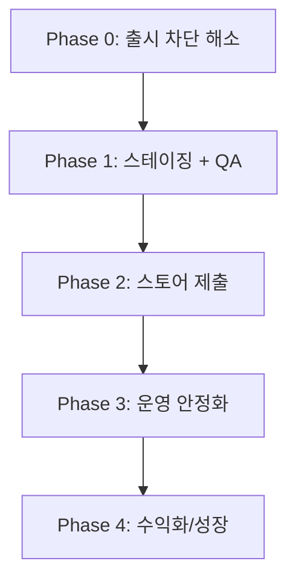

# ExpiryMate Production Launch Roadmap

ExpiryMate 서비스 출시를 위한 **기준 문서**입니다.  
기능 구현 우선순위, 인프라·보안·스토어 제출·운영 작업의 순서를 정의합니다.

> **문서 기준일:** 2026-07-13 (최종 갱신)  
> **대상 저장소:** `expirymate-monorepo` (`apps/mobile`, `apps/api`, `apps/admin`, `packages/shared`)

---

## 1. 현재 상태 요약

| 영역 | 완성도 | 평가 |
|------|--------|------|
| 모바일 핵심 UX | ~95% | 장고 브랜드 UI 리디자인(1→14) 완료 + 바코드/OCR 스캐너 (dev 빌드 검증) |
| API 비즈니스 로직 | ~85% | Auth, 재고, 레시피, 프라이버시, 구독 검증 API 존재 |
| Admin | ~80% | 상품/재고 관리, Privacy URL, Railway 배포 + **shared 토큰·브랜드 표시 동기화** |
| 배포/인프라 | ~70% | Railway API·Admin·Postgres, Docker, CI, health, Resend 메일 연동 |
| 스토어 출시 준비 | ~65% | EAS preview APK 성공, **iOS dev 빌드·실기기 스캐너 QA** 진행 |
| 테스트/QA | ~50% | API 단위 테스트, GitHub Actions CI, 스캐너 단위 테스트; E2E·전체 모바일 QA 미완 |

### 1-1. 현재 개발 진척도 (2026-07-13)

**현재 Phase:** Phase 0 완료 → **Phase 1(스테이징 QA) 진행 중**  
**최근 완료(2026-07-13):** 장고야 부탁해 모바일 UI/UX 리디자인 + 장고 캐릭터 리디자인 + Admin 토큰 동기화 — 상세는 [§1-4](#1-4-장고야-부탁해-모바일-uiux--캐릭터-리디자인--2026-07-13)

> 이전 스냅샷(2026-07-08)은 아래 인프라·스캐너 표를 유지합니다. UI 리디자인은 §1-4를 보세요.

#### 프로덕션 인프라 (Railway, 커스텀 도메인 없음)

| 서비스 | URL | 상태 |
|--------|-----|------|
| API | `https://api-production-1504.up.railway.app` | `/health`, `/ready` 200 |
| Admin | `https://admin-production-da74.up.railway.app` | 로그인, `/privacy`, `/privacy/choices` 접근 가능 |
| Postgres | Railway internal | `prisma migrate deploy` 적용 (10 migrations); `ProductMaster` migration(11번째) **미배포** |

#### 완료된 작업

| 구분 | 항목 | 비고 |
|------|------|------|
| **인프라** | API·Admin Dockerfile, `docker-compose.yml` | 로컬 풀스택 검증 |
| **인프라** | Railway API·Admin·Postgres 배포 | `docs/RAILWAY_STAGING.md` 기준 |
| **보안** | `GET /health`, `GET /ready`, `@nestjs/helmet` | release metadata 포함 |
| **보안** | 프로덕션 seed 가드, `AUTH_ALLOW_DEV_FALLBACK=false` 검증 | `production-env.ts` |
| **보안** | Admin CORS/CORP, Admin 로그인 HTTP 400 수정 | `main.ts`, `apps/admin/src/lib/api.ts` |
| **CI/CD** | GitHub Actions: `lint`, `typecheck`, `test` + main push 시 API/Admin build | `.github/workflows/ci.yml` |
| **관측성** | Sentry SDK 연동 (API, Admin, Mobile) | DSN·대시보드 운영 설정은 미완 |
| **메일** | Resend HTTP API 연동 (Railway SMTP 포트 차단 대응) | `mail.service.ts` |
| **메일** | 이메일 인증 API 수동 검증 | Resend 무료 도메인: 가입 이메일로만 발송 가능 |
| **모바일 빌드** | EAS monorepo `@expirymate/shared` 빌드 훅 | `eas-build-post-install` |
| **모바일 빌드** | Reanimated 4 + `react-native-worklets`, Sentry SDK 54 정렬 | `b677ee8` |
| **모바일 빌드** | Babel duplicate plugin 수정 | `f05e4a4` — JS 번들 로컬 통과 |
| **모바일 빌드** | EAS Android `preview` 빌드 성공 → APK 설치 | `60cb0089` — 에뮬레이터 설치·실행 확인 |
| **모바일 인증** | 로그인 직후 access token 즉시 사용, 세션 관리 개선 | `9fffc23`, `17f8b49` |
| **모바일 스캐너** | 바코드 → OFF 조회 → 유통기한 OCR → 등록 prefill | `54bcd6a` — iOS 실기기 QA 통과 |
| **iOS 네이티브** | `expo prebuild` iOS 프로젝트, `expo-camera`, ML Kit, deployment target 16.4 | `apps/mobile/ios/` |
| **개발 도구** | Cursor 프로젝트 규칙 (API/프론트/아키텍처/공유 계약) | `cursor/add-project-rules` → `main` |
| **모바일 UI** | 홈·보관함·공통 Screen 반응형(compact) 개선 | `cursor/mobile-first-uiux-58b9` → `main` |
| **모바일 UI** | 장고야 부탁해 UI/UX 전면 리디자인 (템플릿 1→14) | §1-4, `docs/MOBILE_REDESIGN_PROMPTS.md` |
| **브랜드** | 장고 캐릭터 리디자인 (아무무형 비율, 냉장고 머리+요리사 모자) | `apps/mobile/assets/characters/jango-*.png` |
| **Admin UI** | shared `cssVariables` 주입 + `appBrand.appNameKo` Admin 표시 | §1-4 |
| **데이터** | `ProductMaster` 스키마·migration·바코드 seed 스크립트 | `apps/api/prisma/schema.prisma`, `apps/api/scripts/seedBarcode.ts`, `pnpm db:seed:barcodes` |

#### 진행 중 / 다음 작업

| 우선순위 | 항목 | 상태 |
|----------|------|------|
| 1 | ~~EAS Android `preview` 빌드 성공 → APK 설치~~ | ✅ 완료 (`60cb0089`) |
| 2 | Preview APK / iOS dev 빌드로 Railway API 회원가입·로그인·AI 추천 QA | **진행 중** |
| 3 | iOS EAS preview/production 빌드 (스캐너 포함) | **미착수** — 현재는 로컬 dev 빌드만 검증 |
| 4 | Resend 도메인 인증 | 임의 수신자(예: naver.com)로 메일 발송 |
| 5 | Sentry DSN 3종 (API, Admin, Mobile) EAS/Railway env | 코드만 연동됨 |
| 6 | `/health` uptime monitor | Better Stack, UptimeRobot 등 |
| 7 | OAuth 프로덕션 client ID (Google/Kakao/Apple) | preview/production 빌드용 |
| 8 | Apple Developer Program ($99/년) | 스토어 출시·Push·Sign in with Apple용 (Personal Team 제한 해소) |
| 9 | `ProductMaster` migration 배포 + 식품안전나라 바코드 적재 | **코드 완료, 적재 미착수** — API `ERROR-500`, Railway internal URL로 로컬 migrate 실패 (§1-3) |

#### 알려진 제약

- **Resend 무료 tier:** 도메인 미인증 시 Resend 가입 이메일로만 발송 가능
- **Expo Go vs EAS/dev build:** 카메라·ML Kit·바코드 스캔은 **Expo Go 불가**. `expo run:ios` / `expo run:android` 또는 EAS internal 빌드 필요
- **iOS Personal Team:** Push Notifications·Sign In with Apple entitlement 미지원 → 로컬 테스트 시 `ExpiryMate.entitlements` 비우기 또는 `EXPO_IOS_PERSONAL_TEAM=1` (§1-2 참고)
- **iOS 26 + Vision Camera v5:** Nitro 기반 `react-native-vision-camera` v5는 iOS 26에서 SIGABRT 이슈 보고됨 → **expo-camera**로 대체 완료
- **EAS 빌드 이력:** shared `dist` 누락 → Gradle 실패 → Babel duplicate → 순차 수정 → `60cb0089` 빌드 성공
- **Railway Postgres internal URL:** `postgres.railway.internal`은 Railway 내부 네트워크 전용. 로컬 Mac에서 `prisma migrate deploy`·seed 실행 시 **Public Networking / TCP Proxy URL** 필요
- **식품안전나라 C005 API:** 2026-07-08 1차 실행 시 `ERROR-500 (서버오류입니다.)` — 제공 서버 장애로 스크래핑·DB 적재 미진행

#### 관련 커밋 (`main`, 2026-07-08 기준)

| 커밋 | 내용 |
|------|------|
| `cea9ef9`~`0c9f9c2` | Phase 0: health, Docker, CI, Sentry, Admin Docker |
| `7bb9d98` | Resend HTTP API (Railway SMTP 우회) |
| `1a67faf`, `575109a` | EAS monorepo shared 빌드 훅 |
| `b677ee8` | worklets + Sentry Expo 54 정렬 |
| `f05e4a4` | Babel duplicate plugin 수정 |
| `9fffc23`, `17f8b49` | 모바일 세션·토큰 즉시 사용 개선 |
| `54bcd6a` | 제품 스캐너 (바코드 + OCR + OFF + iOS 네이티브) |
| `a38174d` | PR #6: `ai-model-auth` → `main` 머지 |
| `dd1ee6a` | Cursor 프로젝트 규칙 → `main` |
| `21a7414` | 모바일 반응형 UI → `main` (홈 바코드 버튼 유지) |

#### 브랜치 통합 상태 (2026-07-08)

| 브랜치 | `main` 반영 |
|--------|-------------|
| `ai-model-auth` | ✅ PR #6 |
| `cursor/add-project-rules` | ✅ `dd1ee6a` |
| `cursor/mobile-first-uiux-58b9` | ✅ `21a7414` |
| `cursor/phase-0-code-foundation` | ✅ 기존 PR #3–#5 |
| `cursor/production-launch-roadmap-58b9` | ✅ 기존 머지 |

### 1-2. 제품 스캐너 (바코드 + 유통기한 OCR) — 2026-07-08

홈 화면 **「바코드로 바로 등록」** 에서 진입하는 단일 카메라 화면으로, 바코드 인식 → 상품 조회 → 유통기한 OCR → 등록 화면 prefill까지 **끊김 없이** 처리합니다.

#### 사용자 플로우

```
홈 → 바코드로 바로 등록
  → [1/2] 실시간 바코드 스캔 (EAN-13/8, UPC-A/E)
  → 워터폴 상품 조회 (ProductMaster → Open Food Facts → 수동 입력)
  → [2/2] 유통기한 OCR (ML Kit, 한국어 날짜 형식)
  → 확인 바텀시트 → 등록 화면 (prefill + expirySource: ocr_detected)
```

#### 기술 스택

| 역할 | 라이브러리 | 비고 |
|------|-----------|------|
| 카메라 프리뷰·바코드 | `expo-camera` (`CameraView.onBarcodeScanned`) | iOS 26 안정성 위해 Vision Camera v5 대신 채택 |
| 유통기한 OCR | `@react-native-ml-kit/text-recognition` | 스냅샷 `takePictureAsync` → ML Kit |
| 상품 조회 | `GET /product-masters/lookup` | DB → OFF → `not_found` 워터폴 |
| 크라우드소싱 | `POST /product-masters/contribute` | 미조회 시 유저 이름 저장 |
| 날짜 파싱 | `parseExpirationDate` | `YYYY.MM.DD`, `YY.MM.DD`, `YYYY년 MM월 DD일` 등 |

#### 주요 파일

| 경로 | 설명 |
|------|------|
| `apps/mobile/app/scanner.tsx` | Expo Router 라우트 |
| `apps/mobile/src/features/scanner/ScannerScreen.tsx` | 카메라 UI, ROI, 확인 바텀시트·수동 입력 |
| `apps/mobile/src/features/scanner/useProductScanner.ts` | 상태 머신·워터폴 조회·OCR 루프 |
| `apps/api/src/modules/product-masters/` | 워터폴 lookup·contribute API |
| `apps/mobile/src/features/scanner/parseExpirationDate.ts` | 유통기한 정규식 파서 |
| `apps/mobile/src/features/scanner/parseExpirationDate.test.ts` | 파서 단위 테스트 (8건) |
| `apps/mobile/app/(tabs)/home.tsx` | 진입 버튼 |
| `apps/mobile/app.json` | 카메라 권한, `expo-camera` 플러그인, iOS 16.4 deployment target |
| `apps/mobile/ios/` | `expo prebuild` 생성 네이티브 프로젝트 |

#### 검증 상태

| 항목 | 상태 |
|------|------|
| `parseExpirationDate` 단위 테스트 | ✅ |
| typecheck / lint | ✅ |
| iOS 실기기 바코드 인식 | ✅ (expo-camera 실시간 스캔) |
| iOS 실기기 유통기한 OCR | ✅ |
| ProductMaster 워터폴 상품명 조회 | ✅ |
| Android 실기기 QA | ⬜ 미완 |
| EAS 빌드에 스캐너 포함 | ⬜ 미완 |

#### iOS 로컬 개발 빌드 (실기기)

```bash
# 터미널 1 — Metro
pnpm --filter @expirymate/mobile dev

# 터미널 2 — 네이티브 빌드·설치 (최초 또는 네이티브 의존성 변경 시)
pnpm --filter @expirymate/mobile exec expo run:ios --device "기기 이름"
```

- **Metro 없이 앱만 실행**하면 `No script URL provided` 오류 발생 — dev 빌드는 Metro 번들러 필요
- Mac과 iPhone **동일 Wi‑Fi** 또는 USB + Xcode 네트워크 페어링
- **Personal Team(무료 Apple ID):** `apps/mobile/ios/ExpiryMate/ExpiryMate.entitlements`에서 Push/Apple 로그인 제거, Xcode Signing에서 해당 capability 제거. 또는 `EXPO_IOS_PERSONAL_TEAM=1`로 prebuild 시 플러그인 제외 (`app.config.js`)

#### 남은 작업 (스캐너)

- Android 실기기 QA
- EAS `preview` / `production` 프로필에 스캐너 포함 빌드·검증
- 흐릿한 바코드·반사·저조도 환경 인식률 개선 (필요 시)
- 상품 카탈로그(`GET /products`)와 스캐너 결과 병합 UX (Phase 4)
- 국내 바코드 마스터(`ProductMaster`) 조회 API 연동 — OFF 대체·병행 (§1-3) ✅ 2026-07-10

### 1-3. 바코드 상품 마스터 (`ProductMaster`) 적재 — 2026-07-08

국내 식품 바코드 초기 카탈로그를 **식품안전나라 공공데이터 API (C005)** 에서 1회성 배치로 수집해 `ProductMaster` 테이블에 적재하는 작업입니다. 기존 `Product`(Admin/데모 카탈로그)와 분리된 **원천 바코드 마스터**이며, 향후 모바일 스캐너가 Open Food Facts 대신·병행 조회할 데이터 소스가 됩니다.

#### 데이터 소스·매핑

| API 필드 | DB 컬럼 | 비고 |
|----------|---------|------|
| `BAR_CD` | `barcode` | `@unique`, 숫자만·전부 0·공백 제외 |
| `PRDLST_NM` | `name` | 빈 값 제외 |
| `BSSH_NM` | `brand` | 없으면 `알 수 없음` |
| `PRDLST_DCNM` | `category` | 없으면 `기타` (공공데이터 원문 문자열) |

- **Endpoint:** `http://openapi.foodsafetykorea.go.kr/api/{API_KEY}/C005/json/{startIdx}/{endIdx}`
- **페이징:** 1~1000, 1001~2000 … (요청당 최대 1,000건)
- **Rate limit:** 요청 간 **500ms** 이상 순차 대기 (병렬 요청 금지)
- **저장:** `upsert` — 동일 바코드는 `name`, `category`만 갱신 (`brand` 유지)

#### 구현 파일

| 경로 | 설명 |
|------|------|
| `apps/api/prisma/schema.prisma` | `ProductMaster` 모델 |
| `apps/api/prisma/migrations/20260708041000_add_product_master/` | 테이블 migration |
| `apps/api/scripts/seedBarcode.ts` | 스크래핑·검증·upsert 배치 스크립트 |
| `apps/api/package.json` | `db:seed:barcodes` |
| 루트 `package.json` | `pnpm db:seed:barcodes` 프록시 |

#### 실행 절차 (1회성)

```bash
# 1) ProductMaster 테이블 생성 (Railway **외부 접속** Postgres URL 사용)
DATABASE_URL="postgresql://...@...railway.app:PORT/railway" pnpm db:migrate:deploy

# 2) 바코드 적재 (API 키는 코드에 저장하지 않고 env로 주입)
DATABASE_URL="postgresql://...@...railway.app:PORT/railway" \
FOODSAFETY_API_KEY="..." \
pnpm db:seed:barcodes
```

- `pnpm db:seed` (개발용 wipe seed)와 **별개** — 프로덕션에서도 `db:seed:barcodes`만 단독 실행 가능 (upsert만 수행)
- migration 실패 시 seed는 `ProductMaster` 테이블 부재로 실패할 수 있으므로 `&&`로 묶어 순서 보장 권장

#### 검증·적재 상태 (2026-07-10)

| 항목 | 상태 |
|------|------|
| 스키마·migration·스크립트·실행 명령 | ✅ |
| `source` / `imageUrl` / `contributedByUserId` 필드 | ✅ (`20260710050000_product_master_source_fields`) |
| 워터폴 조회 API `GET /product-masters/lookup?barcode=` | ✅ DB → Open Food Facts → `not_found` |
| 크라우드소싱 `POST /product-masters/contribute` | ✅ 인증 사용자, 식품안전/OFF 행은 덮어쓰지 않음 |
| 모바일 스캐너 워터폴 연동 | ✅ 클라이언트 OFF 직접 호출 제거 |
| Railway `ProductMaster` 적재 | ✅ (사용자 확인: 식품안전나라 스크래핑 데이터 적재됨) |

#### 워터폴 조회 순서

```
GET /product-masters/lookup?barcode=
  1) ProductMaster (식품안전나라 / OFF 캐시 / 유저 기여)
  2) Open Food Facts (히트 시 ProductMaster에 캐시)
  3) not_found → 모바일에서 수동 입력 → POST /product-masters/contribute
```

#### 다음 작업

1. Railway에 `20260710050000_product_master_source_fields` migration 배포
2. Android 실기기 QA
3. 유저 기여 데이터 관리자 검수 UX (선택)

### 1-4. 장고야 부탁해 모바일 UI/UX · 캐릭터 리디자인 — 2026-07-13

`.cursorrules` + `@expirymate/shared` 디자인 토큰 + `docs/MOBILE_REDESIGN_PROMPTS.md` 템플릿(1→14) 기준으로 **UI/카피/브랜드만** 정리했습니다. API·상태관리·비즈니스 로직은 변경하지 않았습니다.

#### 완료 범위

| 순서 | 항목 | 상태 |
|------|------|------|
| 1 | 공통 컴포넌트 (`Screen`, `Button`, `FormField`, `Mascot`, 토큰) | ✅ |
| 2 | `BottomSheet` / `StepFlow` / `EmptyState` / `SectionHeader` | ✅ |
| 3 | 재료 등록 (`register.tsx` Step) | ✅ |
| 4 | 홈 | ✅ |
| 5 | 보관함 목록 | ✅ |
| 6 | 재료 상세 | ✅ |
| 7 | 스캐너 UI (로직 유지) | ✅ |
| 8 | 요리 추천 | ✅ |
| 9 | 설정 | ✅ |
| 10 | 온보딩 / 진입 | ✅ |
| 11 | 인증 화면군 | ✅ |
| 12 | 개인정보 / 계정 정리 | ✅ |
| 13 | UX 라이팅 전수 (대화형 한국어·장고 톤) | ✅ |
| 14 | Admin 토큰·브랜드 동기화 | ✅ |

#### 장고 캐릭터

| 항목 | 내용 |
|------|------|
| 정체성 | 냉장고 셰프 메이트 — 머리=미니 냉장고, 요리사 모자 |
| 비율 | 아무무형 chibi (머리 비중↑, 몸통·팔다리 짧게) |
| mood | `idle` / `happy` / `worry` / `cooking` / `empty` |
| 에셋 | `apps/mobile/assets/characters/jango-{mood}.png` |
| 컴포넌트 | `apps/mobile/src/components/Mascot.tsx`만 사용 |

#### Admin

- `cssVariableBlock()`을 `apps/admin/app/layout.tsx`에서 주입 → mobile과 동일 semantic 토큰
- 표시명: `{appBrand.appNameKo} Admin` (ExpiryMate Admin 금지)
- raw hex / Tailwind `red-*` 제거, `var(--primary|danger|surface|radius-*)` 사용

#### 지시·검증 문서

| 경로 | 역할 |
|------|------|
| `docs/MOBILE_REDESIGN_PROMPTS.md` | 화면별 리디자인 프롬프트·장고 가이드 |
| `.cursorrules` | 8pt·터치 타깃·대화형 카피 규칙 |
| `packages/shared/src/design/` | semanticColors / spacing / radius / cssVariables |
| `packages/shared/src/constants/brand.ts` | `appBrand` |

#### 남은 UX 후속 (출시 블로커 아님)

- 실기기에서 장고 새 에셋·리디자인 화면 시각 QA
- Metro 캐시로 옛 PNG가 보이면 번들러 재시작
- E2E·전체 모바일 QA는 Phase 1 기존 트랙과 동일

### README와 코드베이스 차이

`README.md`의 **What Is Real vs Mocked** 섹션은 일부 outdated 합니다. 아래는 **코드 기준** 현재 상태입니다.

| README 설명 | 실제 코드 상태 |
|-------------|----------------|
| anonymous bearer only | 이메일/소셜 로그인, refresh, 이메일 인증, 비밀번호 재설정 **구현됨** |
| no email/social login | Apple/Google/Kakao OAuth **구현됨** (`apps/mobile/app/auth/*`, `apps/api/src/modules/auth/*`) |
| no native purchase sheet | **맞음** — entitlement 표시만, 구매 UI 없음 |

**본 로드맵이 README보다 우선**합니다. README 갱신 시 이 문서를 참조하세요.

---

## 2. 로드맵 개요



| Phase | 목표 | 완료 기준 |
|-------|------|-----------|
| **0** | 외부 접속 가능한 서비스 | API·Admin·DB 스테이징/프로덕션 배포, 보안 하드닝 |
| **1** | 실사용 시나리오 검증 | TestFlight/내부 빌드 QA 통과, CI green |
| **2** | 앱 스토어 공개 | iOS/Android 심사 통과, Privacy URL 프로덕션 |
| **3** | 안정적 운영 | 모니터링, 알림 신뢰성, 비용 통제 |
| **4** | 수익화·성장 | IAP, 카탈로그 UX, OCR, 분석 |

### Phase 전환 원칙

각 Phase는 체크리스트를 단순히 수행하는 것이 아니라, 아래 **Done Criteria**를 만족해야 다음 Phase로 넘어갑니다.

| Phase | 다음 단계로 넘어가기 위한 최소 기준 |
|-------|--------------------------------------|
| **0 → 1** | 프로덕션/스테이징 API, DB, Admin이 외부에서 접속 가능하고 `/health`가 정상 응답 |
| **1 → 2** | 내부 빌드 QA, CI, crash/error reporting, 핵심 인증·재고·AI 추천 플로우 검증 완료 |
| **2 → 3** | 스토어 심사 제출/승인, 개인정보·데이터 삭제·AI 고지·계정 삭제 정책 검증 완료 |
| **3 → 4** | 장애 대응, 백업, 비용 한도, 알림 운영 체계가 실제 운영 환경에서 검증됨 |

---

## Phase 0 — 출시 차단 해소 (최우선)

**목표:** 로컬 MVP → 외부에서 접속 가능한 서비스

### Phase 0 Done Criteria

- [x] 프로덕션 또는 스테이징 API URL에서 `GET /health` 200 응답 — Railway API
- [x] 프로덕션 또는 스테이징 DB에 `prisma migrate deploy` 성공 — Railway Postgres
- [x] Admin 프로덕션 또는 스테이징 URL 접속 가능 — Railway Admin
- [x] `AUTH_ALLOW_DEV_FALLBACK=false` 환경에서 로그인/인증 플로우 정상 동작 — Admin 로그인 검증
- [x] 프로덕션 환경에서 seed 스크립트 실행 방지 또는 운영 절차상 금지 명시 — `seed.ts` 가드
- [~] SMTP 실제 발송으로 이메일 인증·비밀번호 재설정 성공 — Resend HTTP API 동작, **도메인 인증·임의 수신자 발송 미완**
- [~] EAS preview/production 빌드가 실제 API URL을 호출 — preview APK 빌드·설치 완료, **실기기/에뮬레이터 QA 진행 중**
- [x] 최소 CI(`lint`, `typecheck`, `test`)가 PR에서 통과 — GitHub Actions

### 0-1. 백엔드 + DB 호스팅

현재 API는 `pnpm dev:api`로만 실행 가능하며, 프로덕션 배포 설정이 없습니다.

| 작업 | 상세 | 관련 경로 |
|------|------|-----------|
| PostgreSQL 프로덕션 DB | Prisma 마이그레이션 10개 적용, `ProductMaster`(11번째) 미배포 | `apps/api/prisma/migrations/` |
| API 호스팅 | Nest `build` + `start` 기반 PaaS 배포 | `apps/api/package.json` |
| Admin 호스팅 | Next.js 빌드·배포 (Privacy URL 의존) | `apps/admin/` |
| Docker Compose | 로컬·스테이징·CI 환경 통일 | ✅ `docker-compose.yml` |
| 마이그레이션 스크립트 분리 | dev: `migrate dev` / prod: `migrate deploy` | ✅ `db:migrate:deploy` |

**프로덕션 DB 주의:** `pnpm db:seed`는 모든 테이블을 wipe합니다. 프로덕션 DB에서 실행 금지.  
**바코드 마스터 적재:** `pnpm db:seed:barcodes`는 `ProductMaster`만 upsert하며 wipe하지 않음. `FOODSAFETY_API_KEY` 필요 (§1-3).

### 0-2. 프로덕션 환경변수·시크릿

`.env.example`, `apps/api/.env.example`, `apps/mobile/.env.example` 기준.

#### 필수 (없으면 출시 불가)

```env
# API
DATABASE_URL=
AUTH_TOKEN_SECRET=                    # 강한 랜덤값
AUTH_ALLOW_DEV_FALLBACK=false         # 프로덕션 필수
OPENAI_API_KEY=
SMTP_HOST / SMTP_PORT / SMTP_USER / SMTP_PASS / SMTP_FROM
CORS_ORIGIN_ADMIN=                    # Admin 프로덕션 origin
CORS_ORIGIN_MOBILE=                   # Expo/Web origin
PRIVACY_POLICY_URL=                   # Admin /privacy 프로덕션 URL
PRIVACY_CHOICES_URL=                  # Admin /privacy/choices 프로덕션 URL

# Mobile (EAS secrets)
EXPO_PUBLIC_API_BASE_URL=             # API 프로덕션 URL
EXPO_PUBLIC_APP_ENV=production
```

#### OAuth (소셜 로그인 사용 시)

```env
GOOGLE_OAUTH_CLIENT_ID=
EXPO_PUBLIC_GOOGLE_OAUTH_CLIENT_ID=
EXPO_PUBLIC_KAKAO_OAUTH_CLIENT_ID=
# Apple Sign-In: 번들 ID + App Store Connect 설정
```

#### 푸시 알림 (원격 만료 알림 사용 시)

```env
PUSH_REMINDER_SCHEDULER_ENABLED=true  # 단일 API 인스턴스에서만
EXPO_PUSH_ACCESS_TOKEN=               # Expo push security 사용 시
# app.json extra.eas.projectId 설정 필요
```

#### 구독 검증 (IAP 출시 시)

```env
IAP_ALLOWED_PRODUCT_IDS=expirymate_premium_monthly,expirymate_premium_yearly
APPLE_APP_STORE_ISSUER_ID / KEY_ID / PRIVATE_KEY
GOOGLE_PLAY_SERVICE_ACCOUNT_EMAIL / PRIVATE_KEY
```

#### 바코드 마스터 적재 (1회성 배치, §1-3)

```env
FOODSAFETY_API_KEY=                    # 식품안전나라 공공데이터 API 인증키 (코드·저장소에 커밋 금지)
```

> Railway에서 로컬 실행 시 `DATABASE_URL`은 `postgres.railway.internal`이 아닌 **Public Postgres URL**을 사용하세요.

> **참고:** 루트 `.env.example`에 `RECIPE_*` 변수가 더 완전합니다. `apps/api/.env.example`보다 루트 파일을 참조하세요.

### 0-3. 보안 하드닝

| 항목 | 현재 | 조치 | 관련 경로 |
|------|------|------|-----------|
| Dev auth fallback | `AUTH_ALLOW_DEV_FALLBACK=true` 시 admin 권한 부여 | 프로덕션 `false` | `apps/api/src/modules/auth/auth.service.ts` |
| Seed admin 비밀번호 | 기본 `admin1234` | 프로덕션 seed 금지 또는 강제 변경 | `apps/api/prisma/seed.ts` |
| API rate limit | 레시피만 in-memory | Redis 또는 API Gateway | `apps/api/src/modules/recipes/recipes.service.ts` |
| 보안 헤더 | 없음 | `@nestjs/helmet` 추가 | ✅ `apps/api/src/main.ts` |
| 500 에러 | exception message 노출 | 프로덕션에서 details 제거 | ✅ `http-exception.filter.ts` |
| Health check | 없음 | `GET /health`, `GET /ready` 추가 | ✅ `apps/api/src/modules/health/` |

#### Admin 보안 체크리스트

Admin은 내부 운영 도구이지만 개인정보·재고 데이터 접근 권한이 있으므로 별도 보안 기준이 필요합니다.

- [ ] Admin refresh cookie 설정 검토: `HttpOnly`, `Secure`, `SameSite`, production domain
- [ ] Admin 로그인 brute-force 방지: rate limit 또는 WAF/API Gateway 제한
- [ ] 프로덕션 관리자 계정 생성·초기화 절차 문서화
- [ ] 기본 관리자 비밀번호 사용 금지 (`admin1234` 등)
- [ ] 관리자 권한 확인 로직과 `AdminGuard` 테스트 보강
- [ ] 주요 관리자 작업 감사 로그 검토: 상품 변경, 사용자/재고 조회, 권한 변경

### 0-4. CI/CD 파이프라인

✅ `.github/workflows/ci.yml` 구현됨:

```
PR  → lint + typecheck + test
main → API/Admin 빌드
```

루트 스크립트: `pnpm lint`, `pnpm typecheck`, `pnpm test`

---

## Phase 1 — 스테이징 + QA

**목표:** TestFlight / 내부 테스트로 실제 사용자 시나리오 검증

### Phase 1 Done Criteria

- [ ] EAS preview 빌드가 스테이징 API와 정상 연동
- [ ] 수동 QA 체크리스트 전 항목 통과
- [ ] PR CI에서 `lint`, `typecheck`, `test` 통과
- [ ] API/Admin/Mobile crash/error reporting 연동
- [ ] `/health` uptime monitor 등록
- [ ] 핵심 외부 의존성 장애 시 UX 확인: OpenAI, SMTP, Expo Push
- [ ] 스토어 심사에 필요한 Privacy URL, Support URL, 계정 삭제 플로우 검증

### 1-1. 스테이징 환경

| 구성 | 예시 | 용도 | 관련 경로 |
|------|------|------|-----------|
| API | `api.staging.expirymate.com` | 모바일·Admin 연동 | `apps/api/` |
| Admin | `admin.staging.expirymate.com` | Privacy 페이지, 운영 도구 | `apps/admin/` |
| Mobile | EAS `preview` 프로필 | 내부 빌드 | `apps/mobile/eas.json` |

### 1-2. 출시 전 관측성

Sentry와 uptime monitor는 운영 안정화 항목이지만, **스토어 제출 전** 연동되어 있어야 합니다. 심사 중 크래시나 API 장애가 발생하면 원인 파악이 어려워집니다.

| 항목 | 최소 기준 |
|------|-----------|
| Mobile crash reporting | production/preview 빌드에서 JS/native error 수집 |
| API error reporting | 5xx, auth failure, external API failure 추적 |
| Admin error reporting | 로그인/운영 화면 오류 추적 |
| Uptime monitor | `GET /health` 외부 모니터링 |
| Release tagging | EAS build version, API git SHA, Admin build version 식별 가능 |

### 1-3. 수동 QA 체크리스트

```
[ ] 익명 세션 → 재료 등록 → 대시보드 반영
[ ] 홈 → 바코드로 바로 등록 → 워터폴 상품 조회 → 유통기한 OCR → 등록 prefill
[ ] 회원가입 → 이메일 인증 → 로그인
[ ] 익명 데이터 → 로그인/가입 시 merge
[ ] Apple / Google / Kakao OAuth
[ ] 비밀번호 찾기 / 재설정 (SMTP 실제 발송)
[ ] AI 추천: 동의 → 생성 → 히스토리 조회
[ ] 푸시 토큰 등록 + (스케줄러 ON 시) 만료 알림 수신
[ ] 계정 삭제 → 데이터 완전 삭제 확인
[ ] Admin 로그인 → 상품 CRUD
[ ] Privacy Policy / Data Deletion URL 접근 (심사용)
```

### 1-4. 테스트 자동화 보강

| 우선순위 | 대상 | 현재 |
|----------|------|------|
| 1 | Auth (OAuth, refresh, merge) | API 단위 테스트 일부 |
| 2 | Products, Dashboard, Admin | 테스트 없음 |
| 3 | Mobile auth / recipe UI | 3개 unit test |
| 4 | Scanner `parseExpirationDate` | ✅ 8 tests (`parseExpirationDate.test.ts`) |
| 5 | E2E (Detox / Maestro) | 없음 |

테스트 위치: `apps/api/src/modules/*/*.test.ts`, `apps/mobile/src/**/*.test.ts`

---

## Phase 2 — App Store / Play Store 제출

**목표:** 심사 통과 및 첫 공개

### Phase 2 Done Criteria

- [ ] iOS/Android production 빌드 생성 및 실제 API 연동 확인
- [ ] App Store Privacy Nutrition Label 작성 완료
- [ ] Google Play Data Safety Form 작성 완료
- [ ] Privacy Policy, Data Deletion, Support URL이 프로덕션 도메인에서 접근 가능
- [ ] 앱 아이콘, 스플래시, 스크린샷, 앱 설명, 키워드, 연령 등급 준비
- [ ] 푸시 알림 권한 설명 문구와 실제 사용 목적 일치
- [ ] AI 추천 기능에 대한 사용자 고지와 심사 노트 준비
- [ ] 계정 삭제 플로우가 심사 계정으로 재현 가능

### 2-1. App Store 심사 필수 항목

| 항목 | 상태 | 조치 |
|------|------|------|
| Privacy Policy URL | Admin 페이지 존재 | 프로덕션 도메인으로 교체 |
| Data Deletion | 앱 내 + 웹 | `PRIVACY_CHOICES_URL` 연결 |
| AI 데이터 고지 | 구현됨 | 심사 노트에 OpenAI 전송 명시 |
| Sign in with Apple | 구현됨 | App Store Connect 설정 |
| 계정 삭제 | `"삭제"` 확인 문구 | 가이드라인 충족 |
| Support URL | 미정 | 문의/지원 페이지 또는 이메일 안내 URL 준비 |
| App Privacy | 미작성 | Apple Privacy Nutrition Label과 실제 SDK/데이터 수집 일치 |
| Data Safety | 미작성 | Google Play Data Safety Form과 실제 SDK/데이터 수집 일치 |
| 앱 메타데이터 | 미정 | 앱 이름, 설명, 키워드, 카테고리, 연령 등급, 스크린샷 준비 |
| 권한 설명 | 일부 구현 | 푸시 알림, 소셜 로그인, AI 추천 목적을 사용자에게 명확히 설명 |

관련 경로:

- `apps/admin/app/privacy/page.tsx`
- `apps/admin/app/privacy/choices/page.tsx`
- `apps/mobile/app/privacy/account-delete.tsx`

### 2-2. 스토어 제출 자료 체크리스트

```
[ ] 앱 아이콘, 스플래시, 6.7인치/6.5인치 iPhone 스크린샷
[ ] Android phone 스크린샷 및 feature graphic
[ ] 앱 설명: 유통기한 관리, 재고, AI 추천 범위 명확화
[ ] Support URL 또는 고객 문의 페이지
[ ] Marketing URL 또는 서비스 소개 페이지 (선택)
[ ] App Store Privacy Nutrition Label
[ ] Google Play Data Safety Form
[ ] 심사 계정 또는 심사용 로그인 절차
[ ] 계정 삭제 방법 안내
[ ] AI 기능 심사 노트: 어떤 데이터가 OpenAI로 전송되는지
[ ] 푸시 알림 권한 사용 목적
```

### 2-3. EAS 빌드·제출

설정: `apps/mobile/app.json`, `apps/mobile/eas.json`

```bash
cd apps/mobile
eas config
eas build --platform ios --profile production
eas build --platform android --profile production
eas submit --platform ios --profile production
```

**EAS secrets (필수):**

- `EXPO_PUBLIC_API_BASE_URL`
- OAuth client IDs (사용 시)
- (권장) Sentry DSN

### 2-4. 딥링크 / Universal Links

이메일 인증·비밀번호 재설정: `APP_BASE_URL` + `/auth/verify-email`, `/auth/reset-password`

- iOS: Associated Domains
- Android: App Links
- 모바일 화면: `apps/mobile/app/auth/verify-email.tsx`, `reset-password.tsx`

### 2-5. v1 출시 범위 vs v1.1+

| 기능 | v1 (첫 출시) | v1.1+ |
|------|--------------|-------|
| 네이티브 IAP 구매 UI | ❌ entitlement 표시만 | ✅ |
| OCR 유통기한 인식 | ⚠️ dev/내부 빌드 검증 완료 | EAS production 빌드·스토어 포함 |
| 상품 카탈로그 → 등록 UX | ❌ 자유 입력 (OFF 바코드 조회만) | ✅ `/products`·`ProductMaster` 연동 |
| 바코드 스캔 등록 | ⚠️ dev/내부 빌드 검증 완료 | EAS production 빌드·스토어 포함 |
| 국내 바코드 DB (`ProductMaster`) | ⚠️ 스크립트 완료, **적재 미착수** (API `ERROR-500`) | 스캐너 조회 API 연동 |
| 가족/공유 보관함 | ❌ | ✅ |

수익화 없이 먼저 출시하는 경우 IAP는 Phase 4로 미룰 수 있습니다.

---

## Phase 3 — 운영 안정화

**목표:** 장애 대응, 비용 통제, 알림 신뢰성

### Phase 3 Done Criteria

- [ ] API/Admin/Mobile 에러 추적 대시보드 확인 가능
- [ ] `/health` uptime alert가 실제 알림 채널로 전달
- [ ] DB 자동 백업과 복구 절차 검증
- [ ] OpenAI 비용 한도와 rate limit이 운영 환경에서 적용
- [ ] Expo push 실패·receipt 처리 정책 확정
- [ ] 장애 대응 런북 작성 및 팀 내 공유

### 3-1. 모니터링·에러 추적

| 도구 | 대상 |
|------|------|
| Sentry (또는 동급) | API, Mobile, Admin |
| Uptime monitor | `GET /health` |
| OpenAI usage alert | `RECIPE_DAILY_COST_LIMIT_USD` |

> Sentry와 uptime monitor는 Phase 1에서 먼저 연동하고, Phase 3에서는 알림 품질·대시보드·운영 절차를 안정화합니다.

### 3-2. 푸시 알림 운영

- `PUSH_REMINDER_SCHEDULER_ENABLED=true` — **단일 API 인스턴스**에서만 실행
- Expo push receipt polling — **미구현**, 권장 작업
- 실패 delivery 재시도·정리 job

관련: `apps/api/src/modules/notifications/`, `apps/mobile/src/services/notifications.ts`

### 3-3. 레시피 AI 비용·품질

환경변수로 제어 (루트 `.env.example` 참조):

- `RECIPE_RATE_LIMIT_MAX`, `RECIPE_RATE_LIMIT_WINDOW_SECONDS`
- `RECIPE_DAILY_QUOTA`, `RECIPE_CACHE_TTL_SECONDS`
- `RECIPE_DAILY_COST_LIMIT_USD`, `RECIPE_AI_MAX_OUTPUT_TOKENS`

프로덕션: 보수적 한도로 시작 → 사용량 모니터링 후 조정

### 3-4. 백업·복구

- PostgreSQL 자동 백업 (호스팅 제공 또는 `pg_dump` cron)
- Seed 스크립트 프로덕션 실행 금지

### 3-5. Operational Runbook

출시 후 장애 대응을 위해 최소한 아래 절차를 문서화합니다.

| 상황 | 1차 확인 | 대응 원칙 |
|------|----------|-----------|
| API 5xx 증가 | API logs, Sentry, DB connection | 최근 배포·마이그레이션·외부 API 장애 확인 |
| 모바일 크래시 증가 | Sentry release, EAS build version | 재현 가능 여부 확인 후 hotfix 또는 rollback |
| DB 장애 | DB provider status, connection pool | 백업 상태 확인, write 중단 여부 판단 |
| OpenAI 장애/비용 초과 | OpenAI status, recipe error rate, cost dashboard | AI 추천 일시 제한, 사용자에게 재시도 안내 |
| SMTP 장애 | SMTP provider status, mail logs | 인증/재설정 메일 지연 안내, 재발송 UX 확인 |
| Expo Push 장애 | Expo status, push tickets/receipts | 예약 알림 지연 허용 범위 안내, 중복 발송 방지 |
| Push scheduler 중복 실행 | API instance count, scheduler env | `PUSH_REMINDER_SCHEDULER_ENABLED=true` 인스턴스 1개 유지 |

#### 배포·마이그레이션 원칙

- DB migration은 `prisma migrate deploy`로 실행합니다.
- destructive seed는 운영 DB에서 실행하지 않습니다.
- migration rollback은 자동화보다 **forward fix**를 기본 원칙으로 합니다.
- 배포 버전은 API git SHA, Admin build ID, EAS build version으로 추적 가능해야 합니다.

---

## Phase 4 — 수익화·성장 (출시 후)

| 순서 | 작업 | 비고 |
|------|------|------|
| 1 | 네이티브 IAP UI (`expo-iap` 등) | 서버 verify API 존재: `POST /subscriptions/verify` |
| 2 | Apple/Google 구독 webhook | 갱신·취소 자동 반영 |
| 3 | Premium 기능 게이팅 | AI 추천 횟수, 고급 필터 등 |
| 4 | 상품 카탈로그 → 등록 UX | `GET /products` — 모바일 미연동; `ProductMaster` 바코드 lookup API·적재 후 연동 (§1-3) |
| 5 | OCR 유통기한 | ✅ **dev 빌드 구현·실기기 검증** (`ocr_detected`); EAS production·Android QA 남음 |
| 6 | Analytics | Mixpanel / Amplitude 등 |
| 7 | 다중 가구/공유 | 스키마 확장 필요 |

---

## 3. 실행 체크리스트 (권장 순서)

### Step A — 결정

- [x] 호스팅 플랫폼 선택 (API + DB + Admin) — **Railway**
- [~] 프로덕션 도메인 (`api`, `admin`, privacy) — **Railway 기본 URL 사용** (`*.up.railway.app`), 커스텀 도메인 미적용
- [ ] App Store Connect / Play Console 계정
- [~] OpenAI, SMTP, OAuth 자격증명 준비 — OpenAI·Resend API 키 설정, OAuth prod ID·Resend 도메인 미완

### Step B — 인프라

- [x] `docker-compose.yml` (Postgres + API + Admin 로컬)
- [x] API 프로덕션 배포 + `prisma migrate deploy` — Railway (10 migrations; `ProductMaster` 11번째 **미배포**)
- [x] Admin 프로덕션 배포 — Railway
- [x] `GET /health`, `GET /ready` 추가
- [ ] `/health` uptime monitor 등록
- [x] `AUTH_ALLOW_DEV_FALLBACK=false` 검증
- [x] 프로덕션 seed 실행 금지 정책 확정
- [ ] `ProductMaster` migration 배포 + 식품안전나라 바코드 적재 — 스크립트 완료, **API 서버 `ERROR-500`으로 적재 미착수** (§1-3)

### Step C — 연동

- [~] EAS preview 빌드 → 프로덕션 API 연결 — preview APK 빌드·설치 완료, **QA 진행 중**
- [~] iOS dev 빌드 (`expo run:ios`) → 스캐너 실기기 검증 — **바코드·OCR 통과**, EAS iOS 빌드 미착수
- [~] SMTP 실제 메일 (인증 / 재설정) — Resend HTTP API 동작, 도메인 인증 필요
- [ ] OAuth 프로덕션 client ID
- [x] `PRIVACY_*_URL` 프로덕션 반영 — Admin Railway URL
- [~] Mobile/API/Admin Sentry 또는 동급 에러 추적 연동 — SDK 연동 완료, **DSN env 미설정**

### Step D — QA + CI

- [ ] 수동 QA 체크리스트 전 항목 — Admin 로그인만 부분 검증
- [x] GitHub Actions (`lint`, `typecheck`, `test`)
- [ ] 스토어 제출 자료 체크리스트 전 항목
- [ ] OpenAI / SMTP / Expo Push 장애 시 UX 확인

### Step E — 제출

- [ ] EAS production 빌드 (iOS / Android)
- [ ] App Store / Play 심사 제출
- [ ] 심사 노트 작성 (AI 데이터, 계정 삭제, OAuth)
- [ ] 심사 승인 후 운영 런북과 알림 채널 점검

---

## 4. 우선순위 매트릭스

```
긴급 + 중요 (Phase 0, 먼저)
├── API + Postgres 호스팅
├── 프로덕션 env / AUTH 하드닝
├── Admin Privacy URL 프로덕션
├── SMTP (이메일 인증)
├── Health check + uptime monitor
└── EAS + EXPO_PUBLIC_API_BASE_URL

중요 + 덜 긴급 (Phase 1–3)
├── CI/CD
├── Sentry / crash reporting
├── E2E / QA 자동화
├── Operational runbook
└── Rate limit Redis화

나중에 해도 됨 (Phase 4, v1.1+)
├── IAP 구매 UI
├── OCR
├── 상품 카탈로그 UX (`ProductMaster` 국내 바코드 적재 후)
└── 가족 공유
```

---

## 5. 관련 문서·경로

| 문서/경로 | 설명 |
|-----------|------|
| `README.md` | 로컬 개발, env 레이아웃, **현재 진척도 요약** |
| **본 문서** | 출시·운영 우선순위 **기준**, **상세 진척도** |
| `docs/RAILWAY_STAGING.md` | Railway 배포 가이드 (프로덕션 URL 반영 시 갱신) |
| `docs/DEPLOYMENT.md` | Docker, EAS, Sentry, uptime |
| `docs/MOBILE_REDESIGN_PROMPTS.md` | 장고야 부탁해 모바일 UI 리디자인 템플릿·장고 가이드 (§1-4) |
| `apps/mobile/eas.json` | EAS 빌드 프로필 |
| `apps/api/prisma/schema.prisma` | 데이터 모델 |
| `apps/api/.env.example` | API env (루트 `.env.example`과 병행 참조) |
| `apps/admin/app/privacy/` | App Store 심사용 공개 페이지 |

---

## 6. 문서 유지

- **Phase 완료 시:** 해당 섹션 체크리스트 업데이트
- **README 갱신 시:** "What Is Real vs Mocked", "Recommended Next Implementation Order"를 본 문서와 동기화
- **새 blocking 이슈 발견 시:** Phase 0 또는 해당 Phase에 항목 추가

---

## 7. 한 줄 결론

**기능 MVP는 갖춰져 있고, Railway 프로덕션(API·Admin·DB)과 Phase 0 대부분이 완료되었다.**  
**브랜드 UI:** 장고야 부탁해 모바일 리디자인·캐릭터·Admin 토큰 동기화가 반영되었다 (§1-4).  
**다음 관문:** Railway API 실기기 QA(Phase 1) → Resend 도메인·Sentry·uptime → Phase 2 스토어 제출.  
IAP·OCR 고도화·카탈로그 UX는 첫 출시 이후(Phase 4)로 미뤄도 된다.
