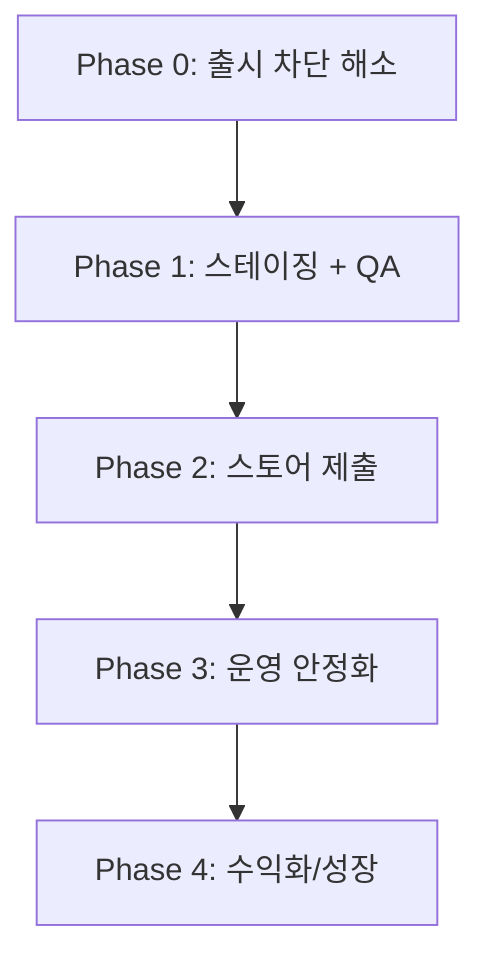

# ExpiryMate Production Launch Roadmap

ExpiryMate 서비스 출시를 위한 **기준 문서**입니다.  
기능 구현 우선순위, 인프라·보안·스토어 제출·운영 작업의 순서를 정의합니다.

> **문서 기준일:** 2026-07-03  
> **대상 저장소:** `expirymate-monorepo` (`apps/mobile`, `apps/api`, `apps/admin`, `packages/shared`)

---

## 1. 현재 상태 요약

| 영역 | 완성도 | 평가 |
|------|--------|------|
| 모바일 핵심 UX | ~80% | 온보딩, 재고, AI 추천, 설정, 프라이버시 UI 구현 |
| API 비즈니스 로직 | ~85% | Auth, 재고, 레시피, 프라이버시, 구독 검증 API 존재 |
| Admin | ~70% | 상품/재고 관리, App Store용 개인정보 페이지 |
| 배포/인프라 | ~15% | Docker, CI/CD, 헬스체크 미구현 |
| 스토어 출시 준비 | ~55% | EAS 설정 있음, 프로덕션 URL·자격증명 미완 |
| 테스트/QA | ~35% | API 단위 테스트 일부, E2E·CI 없음 |

### README와 코드베이스 차이

`README.md`의 **What Is Real vs Mocked** 섹션은 일부 outdated 합니다. 아래는 **코드 기준** 현재 상태입니다.

| README 설명 | 실제 코드 상태 |
|-------------|----------------|
| anonymous bearer only | 이메일/소셜 로그인, refresh, 이메일 인증, 비밀번호 재설정 **구현됨** |
| no email/social login | Apple/Google/Kakao OAuth **구현됨** (`apps/mobile/app/auth/*`, `apps/api/src/modules/auth/*`) |
| no native purchase sheet | **맞음** — entitlement 표시만, 구매 UI 없음 |

**본 로드맵이 README보다 우선**합니다. README 갱신 시 이 문서를 참조하세요.

---

## 2. 로드맵 개요



| Phase | 목표 | 완료 기준 |
|-------|------|-----------|
| **0** | 외부 접속 가능한 서비스 | API·Admin·DB 스테이징/프로덕션 배포, 보안 하드닝 |
| **1** | 실사용 시나리오 검증 | TestFlight/내부 빌드 QA 통과, CI green |
| **2** | 앱 스토어 공개 | iOS/Android 심사 통과, Privacy URL 프로덕션 |
| **3** | 안정적 운영 | 모니터링, 알림 신뢰성, 비용 통제 |
| **4** | 수익화·성장 | IAP, 카탈로그 UX, OCR, 분석 |

---

## Phase 0 — 출시 차단 해소 (최우선)

**목표:** 로컬 MVP → 외부에서 접속 가능한 서비스

### 0-1. 백엔드 + DB 호스팅

현재 API는 `pnpm dev:api`로만 실행 가능하며, 프로덕션 배포 설정이 없습니다.

| 작업 | 상세 | 관련 경로 |
|------|------|-----------|
| PostgreSQL 프로덕션 DB | Prisma 마이그레이션 9개 적용 | `apps/api/prisma/migrations/` |
| API 호스팅 | Nest `build` + `start` 기반 PaaS 배포 | `apps/api/package.json` |
| Admin 호스팅 | Next.js 빌드·배포 (Privacy URL 의존) | `apps/admin/` |
| Docker Compose | 로컬·스테이징·CI 환경 통일 | **신규** `docker-compose.yml` |
| 마이그레이션 스크립트 분리 | dev: `migrate dev` / prod: `migrate deploy` | `apps/api/package.json` `db:migrate` |

**프로덕션 DB 주의:** `pnpm db:seed`는 모든 테이블을 wipe합니다. 프로덕션 DB에서 실행 금지.

### 0-2. 프로덕션 환경변수·시크릿

`.env.example`, `apps/api/.env.example`, `apps/mobile/.env.example` 기준.

#### 필수 (없으면 출시 불가)

```env
# API
DATABASE_URL=
AUTH_TOKEN_SECRET=                    # 강한 랜덤값
AUTH_ALLOW_DEV_FALLBACK=false         # 프로덕션 필수
OPENAI_API_KEY=
SMTP_HOST / SMTP_PORT / SMTP_USER / SMTP_PASS / SMTP_FROM
CORS_ORIGIN_ADMIN=                    # Admin 프로덕션 origin
CORS_ORIGIN_MOBILE=                   # Expo/Web origin
PRIVACY_POLICY_URL=                   # Admin /privacy 프로덕션 URL
PRIVACY_CHOICES_URL=                  # Admin /privacy/choices 프로덕션 URL

# Mobile (EAS secrets)
EXPO_PUBLIC_API_BASE_URL=             # API 프로덕션 URL
EXPO_PUBLIC_APP_ENV=production
```

#### OAuth (소셜 로그인 사용 시)

```env
GOOGLE_OAUTH_CLIENT_ID=
EXPO_PUBLIC_GOOGLE_OAUTH_CLIENT_ID=
EXPO_PUBLIC_KAKAO_OAUTH_CLIENT_ID=
# Apple Sign-In: 번들 ID + App Store Connect 설정
```

#### 푸시 알림 (원격 만료 알림 사용 시)

```env
PUSH_REMINDER_SCHEDULER_ENABLED=true  # 단일 API 인스턴스에서만
EXPO_PUSH_ACCESS_TOKEN=               # Expo push security 사용 시
# app.json extra.eas.projectId 설정 필요
```

#### 구독 검증 (IAP 출시 시)

```env
IAP_ALLOWED_PRODUCT_IDS=expirymate_premium_monthly,expirymate_premium_yearly
APPLE_APP_STORE_ISSUER_ID / KEY_ID / PRIVATE_KEY
GOOGLE_PLAY_SERVICE_ACCOUNT_EMAIL / PRIVATE_KEY
```

> **참고:** 루트 `.env.example`에 `RECIPE_*` 변수가 더 완전합니다. `apps/api/.env.example`보다 루트 파일을 참조하세요.

### 0-3. 보안 하드닝

| 항목 | 현재 | 조치 |
|------|------|------|
| Dev auth fallback | `AUTH_ALLOW_DEV_FALLBACK=true` 시 admin 권한 부여 | 프로덕션 `false` | `apps/api/src/modules/auth/auth.service.ts` |
| Seed admin 비밀번호 | 기본 `admin1234` | 프로덕션 seed 금지 또는 강제 변경 | `apps/api/prisma/seed.ts` |
| API rate limit | 레시피만 in-memory | Redis 또는 API Gateway | `apps/api/src/modules/recipes/recipes.service.ts` |
| 보안 헤더 | 없음 | `@nestjs/helmet` 추가 | `apps/api/src/main.ts` |
| 500 에러 | exception message 노출 | 프로덕션에서 details 제거 | `apps/api/src/common/http-exception.filter.ts` |
| Health check | 없음 | `GET /health`, `GET /ready` 추가 | **신규** |

### 0-4. CI/CD 파이프라인

`.github/workflows` 없음. 최소 파이프라인:

```
PR  → lint + typecheck + test
main → API/Admin 빌드 (+ 선택: 스테이징 배포)
```

루트 스크립트: `pnpm lint`, `pnpm typecheck`, `pnpm test`

---

## Phase 1 — 스테이징 + QA

**목표:** TestFlight / 내부 테스트로 실제 사용자 시나리오 검증

### 1-1. 스테이징 환경

| 구성 | 예시 | 용도 |
|------|------|------|
| API | `api.staging.expirymate.com` | 모바일·Admin 연동 |
| Admin | `admin.staging.expirymate.com` | Privacy 페이지, 운영 도구 |
| Mobile | EAS `preview` 프로필 | 내부 빌드 | `apps/mobile/eas.json` |

### 1-2. 수동 QA 체크리스트

```
[ ] 익명 세션 → 재료 등록 → 대시보드 반영
[ ] 회원가입 → 이메일 인증 → 로그인
[ ] 익명 데이터 → 로그인/가입 시 merge
[ ] Apple / Google / Kakao OAuth
[ ] 비밀번호 찾기 / 재설정 (SMTP 실제 발송)
[ ] AI 추천: 동의 → 생성 → 히스토리 조회
[ ] 푸시 토큰 등록 + (스케줄러 ON 시) 만료 알림 수신
[ ] 계정 삭제 → 데이터 완전 삭제 확인
[ ] Admin 로그인 → 상품 CRUD
[ ] Privacy Policy / Data Deletion URL 접근 (심사용)
```

### 1-3. 테스트 자동화 보강

| 우선순위 | 대상 | 현재 |
|----------|------|------|
| 1 | Auth (OAuth, refresh, merge) | API 단위 테스트 일부 |
| 2 | Products, Dashboard, Admin | 테스트 없음 |
| 3 | Mobile auth / recipe UI | 3개 unit test |
| 4 | E2E (Detox / Maestro) | 없음 |

테스트 위치: `apps/api/src/modules/*/*.test.ts`, `apps/mobile/src/**/*.test.ts`

---

## Phase 2 — App Store / Play Store 제출

**목표:** 심사 통과 및 첫 공개

### 2-1. App Store 심사 필수 항목

| 항목 | 상태 | 조치 |
|------|------|------|
| Privacy Policy URL | Admin 페이지 존재 | 프로덕션 도메인으로 교체 |
| Data Deletion | 앱 내 + 웹 | `PRIVACY_CHOICES_URL` 연결 |
| AI 데이터 고지 | 구현됨 | 심사 노트에 OpenAI 전송 명시 |
| Sign in with Apple | 구현됨 | App Store Connect 설정 |
| 계정 삭제 | `"삭제"` 확인 문구 | 가이드라인 충족 |

관련 경로:

- `apps/admin/app/privacy/page.tsx`
- `apps/admin/app/privacy/choices/page.tsx`
- `apps/mobile/app/privacy/account-delete.tsx`

### 2-2. EAS 빌드·제출

설정: `apps/mobile/app.json`, `apps/mobile/eas.json`

```bash
cd apps/mobile
eas config
eas build --platform ios --profile production
eas build --platform android --profile production
eas submit --platform ios --profile production
```

**EAS secrets (필수):**

- `EXPO_PUBLIC_API_BASE_URL`
- OAuth client IDs (사용 시)
- (권장) Sentry DSN

### 2-3. 딥링크 / Universal Links

이메일 인증·비밀번호 재설정: `APP_BASE_URL` + `/auth/verify-email`, `/auth/reset-password`

- iOS: Associated Domains
- Android: App Links
- 모바일 화면: `apps/mobile/app/auth/verify-email.tsx`, `reset-password.tsx`

### 2-4. v1 출시 범위 vs v1.1+

| 기능 | v1 (첫 출시) | v1.1+ |
|------|--------------|-------|
| 네이티브 IAP 구매 UI | ❌ entitlement 표시만 | ✅ |
| OCR 유통기한 인식 | ❌ | ✅ |
| 상품 카탈로그 → 등록 UX | ❌ 자유 입력 | ✅ `/products` 연동 |
| 가족/공유 보관함 | ❌ | ✅ |

수익화 없이 먼저 출시하는 경우 IAP는 Phase 4로 미룰 수 있습니다.

---

## Phase 3 — 운영 안정화

**목표:** 장애 대응, 비용 통제, 알림 신뢰성

### 3-1. 모니터링·에러 추적

| 도구 | 대상 |
|------|------|
| Sentry (또는 동급) | API, Mobile, Admin |
| Uptime monitor | `GET /health` |
| OpenAI usage alert | `RECIPE_DAILY_COST_LIMIT_USD` |

### 3-2. 푸시 알림 운영

- `PUSH_REMINDER_SCHEDULER_ENABLED=true` — **단일 API 인스턴스**에서만 실행
- Expo push receipt polling — **미구현**, 권장 작업
- 실패 delivery 재시도·정리 job

관련: `apps/api/src/modules/notifications/`, `apps/mobile/src/services/notifications.ts`

### 3-3. 레시피 AI 비용·품질

환경변수로 제어 (루트 `.env.example` 참조):

- `RECIPE_RATE_LIMIT_MAX`, `RECIPE_RATE_LIMIT_WINDOW_SECONDS`
- `RECIPE_DAILY_QUOTA`, `RECIPE_CACHE_TTL_SECONDS`
- `RECIPE_DAILY_COST_LIMIT_USD`, `RECIPE_AI_MAX_OUTPUT_TOKENS`

프로덕션: 보수적 한도로 시작 → 사용량 모니터링 후 조정

### 3-4. 백업·복구

- PostgreSQL 자동 백업 (호스팅 제공 또는 `pg_dump` cron)
- Seed 스크립트 프로덕션 실행 금지

---

## Phase 4 — 수익화·성장 (출시 후)

| 순서 | 작업 | 비고 |
|------|------|------|
| 1 | 네이티브 IAP UI (`expo-iap` 등) | 서버 verify API 존재: `POST /subscriptions/verify` |
| 2 | Apple/Google 구독 webhook | 갱신·취소 자동 반영 |
| 3 | Premium 기능 게이팅 | AI 추천 횟수, 고급 필터 등 |
| 4 | 상품 카탈로그 → 등록 UX | `GET /products` — 모바일 미연동 |
| 5 | OCR 유통기한 | `expirySource: ocr_detected` 스키마 예약 |
| 6 | Analytics | Mixpanel / Amplitude 등 |
| 7 | 다중 가구/공유 | 스키마 확장 필요 |

---

## 3. 실행 체크리스트 (권장 순서)

### Step A — 결정

- [ ] 호스팅 플랫폼 선택 (API + DB + Admin)
- [ ] 프로덕션 도메인 (`api`, `admin`, privacy)
- [ ] App Store Connect / Play Console 계정
- [ ] OpenAI, SMTP, OAuth 자격증명 준비

### Step B — 인프라

- [ ] `docker-compose.yml` (Postgres + API 로컬/스테이징)
- [ ] API 스테이징 배포 + `prisma migrate deploy`
- [ ] Admin 스테이징 배포
- [ ] `GET /health`, `GET /ready` 추가
- [ ] `AUTH_ALLOW_DEV_FALLBACK=false` 검증

### Step C — 연동

- [ ] EAS preview 빌드 → 스테이징 API 연결
- [ ] SMTP 실제 메일 (인증 / 재설정)
- [ ] OAuth 프로덕션 client ID
- [ ] `PRIVACY_*_URL` 프로덕션 반영

### Step D — QA + CI

- [ ] 수동 QA 체크리스트 전 항목
- [ ] GitHub Actions (`lint`, `typecheck`, `test`)
- [ ] Sentry (또는 동급) 연동

### Step E — 제출

- [ ] EAS production 빌드 (iOS / Android)
- [ ] App Store / Play 심사 제출
- [ ] 심사 노트 작성 (AI 데이터, 계정 삭제, OAuth)

---

## 4. 우선순위 매트릭스

```
긴급 + 중요 (Phase 0, 먼저)
├── API + Postgres 호스팅
├── 프로덕션 env / AUTH 하드닝
├── Admin Privacy URL 프로덕션
├── SMTP (이메일 인증)
└── EAS + EXPO_PUBLIC_API_BASE_URL

중요 + 덜 긴급 (Phase 1–3)
├── CI/CD
├── Health check + Sentry
├── E2E / QA 자동화
└── Rate limit Redis화

나중에 해도 됨 (Phase 4, v1.1+)
├── IAP 구매 UI
├── OCR
├── 상품 카탈로그 UX
└── 가족 공유
```

---

## 5. 관련 문서·경로

| 문서/경로 | 설명 |
|-----------|------|
| `README.md` | 로컬 개발, env 레이아웃 (일부 outdated) |
| **본 문서** | 출시·운영 우선순위 **기준** |
| `apps/mobile/eas.json` | EAS 빌드 프로필 |
| `apps/api/prisma/schema.prisma` | 데이터 모델 |
| `apps/api/.env.example` | API env (루트 `.env.example`과 병행 참조) |
| `apps/admin/app/privacy/` | App Store 심사용 공개 페이지 |

---

## 6. 문서 유지

- **Phase 완료 시:** 해당 섹션 체크리스트 업데이트
- **README 갱신 시:** "What Is Real vs Mocked", "Recommended Next Implementation Order"를 본 문서와 동기화
- **새 blocking 이슈 발견 시:** Phase 0 또는 해당 Phase에 항목 추가

---

## 7. 한 줄 결론

**기능 MVP는 갖춰져 있고, 서비스 출시는 Phase 0(호스팅·시크릿·보안) → Phase 1(스테이징 QA) → Phase 2(스토어 제출) 순으로 진행한다.**  
IAP·OCR·카탈로그 UX는 첫 출시 이후(Phase 4)로 미뤄도 된다.
