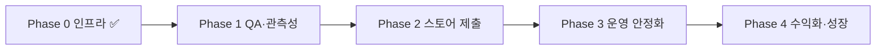

# 장고야 부탁해 (Jango) · 프로젝트 기준 문서

출시 진척도, 우선순위, 배포·운영을 **이 문서 하나**에 모았습니다.  
로컬 개발 온보딩은 [`README.md`](../README.md)를 보세요.

> **문서 기준일:** 2026-07-16  
> **제품 표시명:** 장고야 부탁해 (EN: Jango) · 마스코트: 장고  
> **기술 네임스페이스:** `@expirymate/*`, `com.expirymate.mobile` (의도적 레거시 ID)

---

## 1. 지금 어디인가

| 영역 | 완성도 | 한 줄 |
|------|--------|------|
| 모바일 핵심 UX | ~95% | 장고 UI 리디자인 완료 · 바코드/OCR 스캐너 iOS 실기기 검증 |
| 인증 | ~90% | **카카오·네이버·구글 code 플로우 완료** · 로그인 필수 · 이메일 UI 숨김 · Apple은 유료 개발자 계정 대기 |
| API 비즈니스 | ~85% | 재고·레시피·프라이버시·구독 검증·OAuth 콜백 |
| Admin | ~80% | Railway 배포 · shared 토큰·브랜드 동기화 |
| 배포/인프라 | ~75% | Railway API·Admin·Postgres · CI · Resend · health |
| 스토어 출시 | ~55% | Android preview APK 있음 · iOS EAS·심사 자료 미착수 |
| 테스트/QA | ~50% | API 단위·CI · **실기기 E2E QA 미완료** |

**현재 Phase:** Phase 0 완료 → **Phase 1 (실기기 QA · 관측성)**  
**최근 완료 (2026-07-16):** 소셜 로그인 우선 + 로그인 필수 + HTTPS OAuth 콜백 + 카카오/네이버/구글 authorization code 연동

### 프로덕션 URL

| 서비스 | URL |
|--------|-----|
| API | `https://api-production-1504.up.railway.app` (`/health`, `/ready`, `/oauth/callback`) |
| Admin | `https://admin-production-da74.up.railway.app` (로그인, `/privacy`, `/privacy/choices`) |
| Postgres | Railway internal |

### 인증 현황

| 방식 | 상태 | 비고 |
|------|------|------|
| 카카오 | ✅ | `response_type=code` → API code 교환 |
| 네이버 | ✅ | code → API (`NAVER_OAUTH_*`) |
| 구글 | ✅ | code → API (`GOOGLE_OAUTH_CLIENT_ID` + **`GOOGLE_OAUTH_CLIENT_SECRET`**) |
| Apple | ⚠️ 코드 있음 | Personal Team에서는 entitlement 불가 → **Apple Developer Program ($99/년)** 필요 |
| 이메일 | 구현됨 · UI 숨김 | 소셜 우선. 인증/재설정 메일은 Resend **도메인 인증** 후 완전 동작 |
| 익명 세션 | ❌ 제거 | 온보딩 → 로그인 → 앱. 비로그인 사용 불가 |

공통 Redirect URI (콘솔에 HTTPS만 등록):

`https://api-production-1504.up.railway.app/oauth/callback`  
→ 서버가 `exp://` / `expirymate://` deep link로 브릿지

모바일: `EXPO_PUBLIC_OAUTH_REDIRECT_URI` = 위 URL  
앱 복귀: `WebBrowser.openAuthSessionAsync`가 **앱 스킴**을 대기

---

## 2. 서비스 전 우선순위 (지금 당장)

기능 MVP와 소셜 로그인은 갖춰졌습니다. **출시 블로커는 “검증·운영·스토어”** 쪽입니다.

### P0 — 이번 주에 끝낼 것 (Phase 1 관문)

| # | 작업 | 왜 |
|---|------|-----|
| 1 | **실기기 QA 사인오프** (Android preview APK + iOS dev/preview) | 카카오/네이버/구글 로그인 → 재료 등록 → 홈/보관함 → AI 추천 → 계정 삭제까지 Railway API로 한 바퀴 |
| 2 | **Sentry DSN 3종** (API / Admin / Mobile) | SDK만 있고 DSN 없음 → 심사·내부 배포 중 크래시 원인 추적 불가 |
| 3 | **`/health` uptime 모니터** | API 다운을 사용자가 먼저 알게 됨 |
| 4 | **Resend 도메인 인증** | 임의 수신자 이메일 인증·비밀번호 재설정 (소셜만 써도 계정 복구·문의에 필요) |

### P1 — 스토어 제출 직전 (Phase 1→2)

| # | 작업 | 왜 |
|---|------|-----|
| 5 | **Apple Developer Program 등록** | Sign in with Apple · Push · TestFlight · App Store 공통 전제 |
| 6 | **EAS iOS preview/production** (스캐너 포함) | 지금은 로컬 `expo run:ios` 검증 위주 |
| 7 | **EAS production 빌드**가 Railway API + OAuth env 사용 확인 | `EXPO_PUBLIC_API_BASE_URL`, OAuth client ID, redirect URI |
| 8 | **스토어 메타·심사용 자료** | Privacy Nutrition Label / Play Data Safety · 스크린샷 · Support URL · AI·계정삭제 심사 노트 |

### P2 — 출시 직후 / 병행 가능

| # | 작업 | 비고 |
|---|------|------|
| 9 | Admin 보안 하드닝 | refresh cookie · 로그인 rate limit · 관리자 계정 절차 |
| 10 | 푸시 스케줄러 ON + receipt 처리 | `PUSH_REMINDER_SCHEDULER_ENABLED` 단일 인스턴스 |
| 11 | Android 스캐너 실기기 QA | iOS는 통과 |
| 12 | ProductMaster source-fields migration 배포 확인 | 바코드 적재는 완료된 상태 — migration 잔여분만 점검 |

### 의도적으로 미룸 (v1.1+ / Phase 4)

- 네이티브 IAP 구매 UI (서버 verify API만 있음)
- 가족/공유 보관함
- E2E 자동화 (Detox/Maestro)
- OCR·카탈로그 UX 고도화

---

## 3. Phase 로드맵



| Phase | 목표 | Done Criteria (요약) |
|-------|------|----------------------|
| **0** ✅ | 외부 접속 가능 | Railway API/Admin/DB · health · CI · AUTH 하드닝 |
| **1** 👈 | 실사용 검증 | 실기기 QA · Sentry DSN · uptime · Privacy URL 검증 |
| **2** | 스토어 공개 | EAS production · 심사 자료 · iOS/Android 승인 |
| **3** | 안정 운영 | 알림·백업·비용 한도·런북 |
| **4** | 수익화 | IAP UI · 카탈로그 · 분석 · 공유 |

### Phase 1 Done Criteria

- [ ] Android/iOS 내부 빌드에서 Railway API 핵심 플로우 QA 통과
- [ ] Sentry DSN 설정 (API·Admin·Mobile)
- [ ] `/health` uptime monitor 등록
- [ ] Resend 도메인 인증 (임의 수신자 메일)
- [ ] Privacy / Data Deletion URL 심사용으로 재확인
- [ ] 소셜 로그인 3종(카카오·네이버·구글) 프로덕션 빌드에서 재검증

### Phase 1 수동 QA 체크리스트

```
[ ] 온보딩 → 로그인(필수) → 탭 진입
[ ] 카카오 / 네이버 / 구글 로그인 (HTTPS 콜백 → 앱 복귀)
[ ] (가능 시) Apple 로그인 — 유료 개발자 계정 이후
[ ] 재료 수동 등록 → 홈·보관함 반영
[ ] 홈 → 바코드 등록 → 워터폴 조회 → 유통기한 OCR → prefill (dev/EAS 빌드)
[ ] AI 추천: 동의 → 생성 → 히스토리
[ ] 푸시 토큰 등록 (+ 스케줄러 ON 시 만료 알림)
[ ] 계정 삭제 → 데이터 제거 확인
[ ] Admin 로그인 → 상품 CRUD
[ ] /privacy, /privacy/choices 접근
```

### Phase 2 Done Criteria (요약)

- [ ] iOS/Android production 빌드 + 실제 API
- [ ] App Store Privacy Label / Play Data Safety
- [ ] Support URL · 스크린샷 · 앱 설명 · 심사 노트(AI·계정 삭제·OAuth)
- [ ] Sign in with Apple (유료 계정) 스토어 정책 충족

---

## 4. 완료된 주요 작업

| 구분 | 항목 |
|------|------|
| 인프라 | Railway API·Admin·Postgres · Docker · `GET /health` `/ready` · helmet · seed 가드 |
| CI | GitHub Actions lint/typecheck/test · main push API/Admin build |
| 메일 | Resend HTTP API (Railway SMTP 포트 우회) |
| 모바일 빌드 | EAS Android preview APK · monorepo shared 훅 · Reanimated 정렬 |
| 스캐너 | 바코드 → ProductMaster/OFF → OCR → 등록 prefill (iOS 실기기 ✅) |
| 바코드 DB | `ProductMaster` + 식품안전나라 적재 · lookup/contribute API |
| 브랜드 UI | 리디자인 템플릿 1→14 ✅ · 장고 mood PNG · Admin 토큰 동기화 |
| 인증 | 로그인 필수 · 소셜 우선(카카오→네이버→구글→Apple) · OAuth HTTPS 콜백 · 구글 code+secret |

상세 프롬프트 기록(완료): [`archive/MOBILE_REDESIGN_PROMPTS.md`](./archive/MOBILE_REDESIGN_PROMPTS.md)

### 스캐너 (요약)

```
홈 → 바코드로 바로 등록
  → [1/2] 바코드 스캔
  → ProductMaster → OFF → 수동
  → [2/2] 유통기한 OCR
  → 등록 화면 prefill (expirySource: ocr_detected)
```

- Expo Go 불가 → `expo run:ios|android` 또는 EAS 빌드
- Personal Team: Push/Apple entitlement 제거 또는 `EXPO_IOS_PERSONAL_TEAM=1`

### 알려진 제약

| 제약 | 대응 |
|------|------|
| Resend 무료 · 도메인 미인증 | 가입 이메일로만 발송 → 도메인 인증 |
| iOS Personal Team | Push · Sign in with Apple 불가 |
| Railway Postgres internal URL | 로컬 migrate/seed는 Public TCP URL |
| OAuth 콘솔 | Redirect는 `http(s)`만 · 앱 스킴 직접 등록 불가 |

---

## 5. 배포 · 운영 런북

### 로컬 Docker

```bash
cp .env.docker.example .env.docker   # 선택
pnpm docker:up
curl http://localhost:4000/health
curl http://localhost:4000/ready
pnpm docker:down
```

| 서비스 | URL |
|--------|-----|
| API | http://localhost:4000 |
| Admin | http://localhost:3000 |
| Privacy | http://localhost:3000/privacy |

**프로덕션에서 `pnpm db:seed` 금지** (테이블 wipe). 바코드만 upsert: `pnpm db:seed:barcodes`.

### Railway (현재 운영)

이미 구축됨. 재구성·신규 환경 시:

1. Railway 프로젝트 + PostgreSQL
2. API 서비스: Dockerfile `apps/api/Dockerfile`, `DATABASE_URL` 등 env
3. Admin 서비스: Dockerfile `apps/admin/Dockerfile`, `NEXT_PUBLIC_API_BASE_URL`
4. `prisma migrate deploy` (API 기동 또는 one-off)
5. 커스텀 도메인 없음 → `*.up.railway.app` 사용 중

로컬에서 Railway DB 작업 시 **Public Networking URL** 사용 (`postgres.railway.internal`은 외부에서 안 됨).

### 필수 프로덕션 env (요지)

**API:** `DATABASE_URL`, `AUTH_TOKEN_SECRET`(32+), `AUTH_ALLOW_DEV_FALLBACK=false`, CORS/Privacy HTTPS URL, OpenAI, Resend/SMTP, OAuth(사용 중인 provider), IAP 키(구독 검증 시)

**OAuth (현재 사용):**

```env
KAKAO_OAUTH_CLIENT_ID=
NAVER_OAUTH_CLIENT_ID=
NAVER_OAUTH_CLIENT_SECRET=
GOOGLE_OAUTH_CLIENT_ID=
GOOGLE_OAUTH_CLIENT_SECRET=
# Apple: APPLE_OAUTH_CLIENT_ID — 유료 개발자 계정 이후
```

**Mobile (EAS secrets):**

```env
EXPO_PUBLIC_API_BASE_URL=https://api-production-1504.up.railway.app
EXPO_PUBLIC_OAUTH_REDIRECT_URI=https://api-production-1504.up.railway.app/oauth/callback
EXPO_PUBLIC_KAKAO_OAUTH_CLIENT_ID=
EXPO_PUBLIC_NAVER_OAUTH_CLIENT_ID=
EXPO_PUBLIC_GOOGLE_OAUTH_CLIENT_ID=
EXPO_PUBLIC_SENTRY_DSN=   # 권장
```

전체 맵: 루트 [`.env.example`](../.env.example), [`apps/api/.env.production.example`](../apps/api/.env.production.example)

### Admin 계정 (프로덕션)

seed 의존 금지. 사용자 가입 후 DB에서 `role = 'admin'` 승격. 기본 비밀번호(`admin1234`) 사용 금지.

### EAS

```bash
cd apps/mobile
eas secret:create --name EXPO_PUBLIC_API_BASE_URL --value https://api-production-1504.up.railway.app
eas build --platform android --profile preview
eas build --platform ios --profile preview
# production 제출 시
eas build --platform ios --profile production
eas submit --platform ios --profile production
```

### Sentry

| App | Env |
|-----|-----|
| API | `SENTRY_DSN` |
| Admin | `SENTRY_DSN` / `NEXT_PUBLIC_SENTRY_DSN` |
| Mobile | `EXPO_PUBLIC_SENTRY_DSN` |

DSN 비어 있으면 SDK no-op.

### Uptime

`GET https://api-production-1504.up.railway.app/health` → Better Stack / UptimeRobot 등, non-200·타임아웃 알림.

### 장애 1차 확인

| 상황 | 확인 |
|------|------|
| API 5xx | Railway logs · Sentry · DB |
| 모바일 크래시 | Sentry release · EAS build |
| 메일 미도착 | Resend 도메인·로그 |
| OAuth 실패 | Redirect URI 일치 · client secret · `/oauth/callback` |
| Push 중복 | `PUSH_REMINDER_SCHEDULER_ENABLED=true` 인스턴스 1개만 |

마이그레이션: `prisma migrate deploy` · destructive seed 금지 · rollback보다 forward fix.

### 트러블슈팅

| 증상 | 확인 |
|------|------|
| API 기동 실패 | `validateProductionEnvironment()` 로그 |
| migrate 실패 | Public DB URL · 네트워크 |
| Sentry 무반응 | DSN 설정 여부 |
| 구글 “거의 다 됐어요” 정지 | code 플로우 + `GOOGLE_OAUTH_CLIENT_SECRET` (해시 토큰 방식 폐기) |

---

## 6. v1 출시 범위

| 기능 | v1 | v1.1+ |
|------|----|-------|
| 소셜 로그인 (카카오·네이버·구글) | ✅ | |
| Apple 로그인 | 유료 계정 후 | |
| 수동 재고·유통기한 | ✅ | |
| 바코드·OCR 등록 | EAS 빌드 포함 권장 | 인식률 고도화 |
| AI 레시피 | ✅ | |
| IAP 구매 UI | ❌ | ✅ |
| 가족 공유 | ❌ | ✅ |

---

## 7. 문서 유지

- **단일 기준:** 본 문서 (`docs/PROJECT.md`)
- **README:** 로컬 온보딩 + 진척 요약만. 상세·우선순위는 여기로 링크
- Phase 완료·블로커 발견 시 이 파일의 §1·§2·체크리스트를 갱신

### 통합으로 대체된 문서

| 이전 | 처리 |
|------|------|
| `docs/PRODUCTION_LAUNCH_ROADMAP.md` | 본 문서로 통합 |
| `docs/DEPLOYMENT.md` | §5로 통합 |
| `docs/RAILWAY_STAGING.md` | §5로 통합 |
| `docs/MOBILE_REDESIGN_PROMPTS.md` | `docs/archive/` (완료 기록) |

---

## 8. 한 줄 결론

**소셜 로그인(카카오·네이버·구글)과 핵심 기능은 준비됐다.**  
다음 관문은 **실기기 QA 사인오프 → Sentry·uptime·Resend 도메인 → Apple 개발자 계정·EAS iOS → 스토어 제출**이다.  
IAP·공유 보관함은 첫 출시 이후로 미뤄도 된다.
