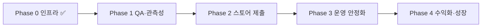

# 장고야 부탁해 (Jango) · 프로젝트 기준 문서

출시 진척도, 우선순위, 배포·운영을 **이 문서 하나**에 모았습니다.  
로컬 개발 온보딩은 [`README.md`](../README.md)를 보세요.  
개발 `.env` 동기화(Doppler · Cursor Cloud)는 [`docs/dev-secrets.md`](./dev-secrets.md)를 보세요.

> **문서 기준일:** 2026-07-24
> **제품 표시명:** 장고야 부탁해 (EN: Jango) · 마스코트: 장고  
> **기술 네임스페이스:** `@expirymate/*`, `com.expirymate.mobile` (의도적 레거시 ID)

---

## 1. 지금 어디인가

| 영역 | 완성도 | 한 줄 |
|------|--------|------|
| 모바일 핵심 UX | ~97% | 장고 UI · 바코드/OCR · 레시피 즐겨찾기 · 공간 전환/공유 관리 구현 |
| 인증 | ~97% | 카카오·네이버·구글·Apple·이메일 실기기 E2E ✅ · 가입 전 공유 초대 이어가기 구현 |
| API 비즈니스 | ~93% | 재고·공간 권한·이메일/1회용 코드 초대·레시피·프라이버시·구독 검증 |
| Admin | ~80% | Railway 배포 · shared 토큰·브랜드 동기화 |
| 배포/인프라 | ~90% | Railway · Resend · `/health` uptime ✅ · Sentry API/Admin ✅ |
| 스토어 출시 | ~72% | 기존 iOS TestFlight QA ✅ · 공유 기능 포함 새 production 빌드/심사 자료 필요 |
| 테스트/QA | ~92% | 자동 검사 269개 ✅ · 공유 기능 운영 배포·2계정 실기기 E2E 대기 |

**현재 Phase:** Phase 1 관문 대부분 완료 → **Phase 2 (스토어 제출 준비)**  
**최근 완료 (2026-07-24):** 자동 검사 269개 통과 · Expo SDK 54 의존성 정렬 · iOS 1.0.0 (5) App Store Connect 업로드 · Android production 최소 권한 RC 빌드 · 초대 개인정보 보관(수락·취소 즉시 이메일 제거 · 비활성 30일 cleanup)과 Privacy/Choices 일치

> **출시 판단 주의:** 공유 기능은 코드·자동 검증까지 완료됐지만 아직 Railway 운영 마이그레이션과 공유 기능 포함 새 TestFlight/Play 빌드의 2계정 E2E를 통과하지 않았다.

### 프로덕션 URL

| 서비스 | URL |
|--------|-----|
| API | `https://api-production-1504.up.railway.app` (`/health`, `/ready`, `/oauth/callback`, `/auth/verify-email`) |
| Admin | `https://admin-production-da74.up.railway.app` (로그인, `/privacy`, `/privacy/choices`) |
| 메일 From | `noreply@mail.devnamu.com` (Resend · 도메인 `devnamu.com`) |
| Postgres | Railway internal |

> API/Admin 커스텀 도메인(예: `api.` / `admin.`)은 아직 `*.up.railway.app`. 메일 전용 서브도메인만 먼저 연결됨.

### 인증 현황

| 방식 | 상태 | 비고 |
|------|------|------|
| 카카오 | ✅ | `response_type=code` → API code 교환 |
| 네이버 | ✅ | code → API (`NAVER_OAUTH_*`) |
| 구글 | ✅ | code → API (`GOOGLE_OAUTH_CLIENT_ID` + **`GOOGLE_OAUTH_CLIENT_SECRET`**) |
| Apple | ✅ TestFlight | Program · entitlement/plugin/EAS production 프로파일 · 신규/재로그인 검증 |
| 이메일 | ✅ 실기기 E2E | 가입·확인·재발송·비밀번호 재설정 통과. Resend HTTP + `mail.devnamu.com` |
| 익명 세션 | ❌ 제거 | 온보딩 → 로그인 → 앱. 비로그인 사용 불가 |

공통 Redirect URI (콘솔에 HTTPS만 등록):

`https://api-production-1504.up.railway.app/oauth/callback`  
→ 서버가 `exp://` / `expirymate://` deep link로 브릿지

모바일: `EXPO_PUBLIC_OAUTH_REDIRECT_URI` = 위 URL  
앱 복귀: `WebBrowser.openAuthSessionAsync`가 **앱 스킴**을 대기

이메일 인증 링크: `AUTH_LINK_BASE_URL` → HTTPS 브릿지(`/auth/verify-email`) → `expirymate://auth/verify-email?token=…`  
프로덕션: `AUTH_LINK_BASE_URL=https://api-production-1504.up.railway.app` (실기기 E2E로 확인됨) · 로컬: `http://localhost:4000`

---

## 2. 서비스 전 우선순위 (지금 당장)

기능·기존 실기기 QA·uptime·Sentry(API/Admin)까지 갖춰졌습니다. 이번 공유 기능은 DB·API·모바일을 함께 바꾸므로 **운영 마이그레이션과 새 release candidate의 2계정 회귀 QA가 첫 관문**입니다.

### P0 — 스토어 직전 (Phase 2 관문)

| # | 작업 | 왜 |
|---|------|-----|
| 1 | **공유 공간 마이그레이션 운영 배포** | Railway API 배포 시 공간·초대 코드 마이그레이션 2개 적용 · `/ready` · `prisma migrate status` 확인 |
| 2 | **공유 기능 포함 EAS production 재빌드** | iOS 1.0.0 (5) 업로드 후 Apple 처리 중 · Android 1.0.0 (5) 최소 권한 AAB 빌드 진행 중 |
| 3 | **2계정 공유 E2E + 핵심 회귀 QA** | 초대·가입/로그인 이어가기·역할·공간 전환·재고 동기화·알림·소유권·계정 삭제 확인 |
| 4 | ~~**초대 개인정보 보관 정책 확정**~~ ✅ | 수락·취소 시 이메일 즉시 제거 · 비활성 초대 최대 30일 보관 후 삭제 · Privacy/Choices·계정 정리와 일치 |
| 5 | **스토어 메타·심사용 자료 확정** | [`store-metadata-draft.md`](./store-metadata-draft.md) · Privacy Label/Data Safety · 공유 화면 포함 스크린샷 · 데모 계정 |
| 6 | **App Store 제출 후 Play production 준비** | iOS 심사 노트/빌드 제출 → Android AAB 내부 테스트·Data Safety·production 제출 |

### P1 — 병행 / 후순위

| # | 작업 | 왜 |
|---|------|-----|
| 7 | **Sentry Mobile** production 스모크 | 새 TestFlight/Android internal에서 공유 화면 포함 오류 수집 확인 |
| 8 | API/Admin 커스텀 도메인 | Privacy·Support URL·브랜드 일관성 |
| 9 | Admin 보안 하드닝 | admin client role 거부 · refresh cookie Path=/auth · inventory pagination/mask · AdminAuditLog |
| 10 | 푸시 스케줄러 ON + receipt 처리 | 공간별 수신 설정 · DB lease · receipt poll · stale pending 재시도 실수신 확인 |
| 11 | ProductMaster source-fields migration 배포 확인 | 바코드 적재는 완료 — migration 잔여분만 |

### 의도적으로 미룸 (v1.1+ / Phase 4)

- 네이티브 IAP 구매 UI (서버 verify API만 있음)
- 실시간 동기화(WebSocket/SSE)와 공간 변경 이력 원장
- 초대 QR·전화번호·공개 재사용 링크
- E2E 자동화 (Detox/Maestro)
- OCR·카탈로그 UX 고도화

---

## 3. Phase 로드맵



| Phase | 목표 | Done Criteria (요약) |
|-------|------|----------------------|
| **0** ✅ | 외부 접속 가능 | Railway API/Admin/DB · health · CI · AUTH 하드닝 |
| **1** ✅ | 실사용 검증 | 실기기 QA · uptime · Sentry API/Admin ✅ (Mobile Sentry 후순위) |
| **2** 👈 | 스토어 공개 | 운영 migration · 공유 2계정 QA · 새 production 빌드 · 심사 자료 · iOS/Android 승인 |
| **3** | 안정 운영 | 알림·백업·비용 한도·런북 |
| **4** | 수익화·성장 | IAP UI · 카탈로그 · 분석 · 실시간 협업/변경 이력 |

### Phase 1 Done Criteria

- [x] Android/iOS 내부 빌드에서 Railway API 핵심 플로우 QA 통과 (소셜·재고·AI·계정삭제)
- [x] Sentry DSN · 스모크 — **API·Admin** (`sentry-smoke-api` / `sentry-smoke-admin`)
- [ ] Sentry Mobile preview 스모크 (`jango-mobile`) — 후순위
- [x] `/health` uptime monitor 등록
- [x] Resend 도메인 인증 (`mail.devnamu.com`) — 임의 수신자 메일
- [x] 프로덕션 `AUTH_LINK_BASE_URL` = Railway API HTTPS
- [x] **이메일 가입·메일 확인·로그인** 실기기 E2E
- [x] **미확인 재발송 · 비밀번호 재설정** 실기기 E2E
- [x] Privacy / Data Deletion URL 심사용으로 재확인
- [x] 소셜 로그인 4종 실기기 재검증

### Phase 1 수동 QA 체크리스트

```
[x] 온보딩 → 로그인(필수) → 탭 진입
[x] 카카오 / 네이버 / 구글 로그인 (HTTPS 콜백 → 앱 복귀)
[x] 이메일 가입 → 인증 메일 수신 → 링크/딥링크로 확인 → 홈 진입
[x] 이메일 로그인 · 미확인 계정 → verify-pending · 재발송
[x] 비밀번호 재설정 메일 → 새 비밀번호로 로그인
[x] Apple 로그인 — TestFlight 신규·재로그인
[x] 재료 수동 등록 → 홈·보관함 반영
[x] 홈 → 바코드 등록 → 워터폴 조회 → 유통기한 OCR → prefill (dev/EAS 빌드)
[x] AI 추천: 동의 → 생성 → 히스토리
[ ] 공유: A가 가족/매장 공간 생성 → B 이메일 또는 1회용 코드 초대 → 미가입/로그인 후 수락
[ ] 공유: 1회용 코드 공간 확인·알림 선택·동시 수락 1명 성공·재사용/취소/만료 차단
[ ] 공유: A/B 재고 등록·수정·소진 → 화면 진입/앱 복귀/당겨서 새로고침 반영
[ ] 공유: 소유자/관리자/구성원 버튼과 API 허용·거부 · 제거·소유권 이전
[ ] 공유: 초대 알림 기본 OFF · 공간별 알림 설정 · 계정 삭제 소유권 차단
[x] 푸시 토큰 등록 (+ 스케줄러 ON 시 만료 알림) — 토큰 등록 TestFlight 확인 · 실수신은 스케줄러 선택
[x] 계정 삭제 → 데이터 제거 확인
[x] Admin 로그인 → 상품 CRUD
[x] /privacy, /privacy/choices 접근
```

### Phase 2 Done Criteria (요약)

- [ ] 공유 기능 포함 iOS production 빌드 + TestFlight QA (1.0.0 build 5 업로드 완료 · Apple 처리/실기기 QA 대기)
- [ ] Android production AAB 내부 테스트 + Play Console production 준비 (1.0.0 versionCode 5 빌드 진행 · 서비스 계정 키/EAS 연결 대기)
- [ ] Railway 공유 공간 migration 적용 · 개인 공간/기존 데이터 백필 확인
- [ ] 두 계정 공유 시나리오와 기존 로그인·스캔·추천·삭제 회귀 QA
- [x] 수락·취소·만료 초대 개인정보의 보관/정리 정책과 공개 방침 일치
- [ ] App Store Privacy Label / Play Data Safety (`docs/store-privacy-declarations.md` 대조)
- [ ] Support URL · 스크린샷 · 앱 설명 · 심사 노트 — 초안 `docs/store-metadata-draft.md`
- [x] Sign in with Apple TestFlight 검증 + 스토어 정책 충족 준비

### Phase 2 권장 실행 순서와 Go/No-Go

1. **운영 DB 보호선 확인**
   - Railway production DB의 최근 백업/복구 가능 여부를 확인한다.
   - API가 `apps/api/Dockerfile`과 `docker-entrypoint.sh`로 배포되는지 확인한다.
2. **API 먼저 배포**
   - expand-only migration을 적용하고 `/ready`가 200인지 확인한다.
   - 아래 SQL에서 누락 건수가 모두 0인지 확인한다.
3. **새 모바일 release candidate 배포**
   - iOS production → TestFlight, Android production AAB → internal track.
4. **두 계정 E2E 및 기존 기능 회귀**
   - §3 수동 QA 체크리스트를 전부 통과하고 Railway/Sentry에 신규 오류가 없는지 본다.
5. **스토어 자료 고정 후 제출**
   - 코드/빌드가 고정된 뒤 Privacy Label/Data Safety, 스크린샷, 설명, 심사 노트를 최종 대조한다.

운영 백필 확인 SQL:

```sql
SELECT COUNT(*) AS users_without_personal_space
FROM "User" u
LEFT JOIN "InventorySpace" s
  ON s."id" = 'personal_' || u."id"
WHERE s."id" IS NULL;

SELECT COUNT(*) AS inventory_without_space
FROM "InventoryItem"
WHERE "spaceId" IS NULL;

SELECT COUNT(*) AS locations_without_space
FROM "UserStorageLocation"
WHERE "spaceId" IS NULL;

SELECT COUNT(*) AS recommendations_without_space
FROM "RecipeRecommendation"
WHERE "spaceId" IS NULL;
```

**Go:** migration/백필 정상 · `/ready` 200 · 초대 메일/딥링크/역할/재고 공유 통과 ·
기존 로그인/스캔/추천/계정 삭제 회귀 없음 · 스토어 선언과 실제 동작 일치.

**No-Go:** migration 실패/누락 · 다른 공간 데이터 노출 · 구성원 권한 우회 ·
초대 이메일 불일치 수락 · 새 빌드 크래시 · 계정 삭제로 공유 재고가 사라지는 경우.

---

## 4. 완료된 주요 작업

| 구분 | 항목 |
|------|------|
| 인프라 | Railway API·Admin·Postgres · Docker · `GET /health` `/ready` · helmet · seed 가드 |
| CI | GitHub Actions lint/typecheck/test · Prisma migrate deploy · API/Admin production build |
| 메일·도메인 | `devnamu.com` 구입 · Resend에 `mail.devnamu.com` 인증 · Resend HTTP API (Railway SMTP 포트 우회) · `SMTP_FROM=noreply@mail.devnamu.com` |
| 이메일 인증 | 가입/로그인 UI · `EmailDomainInput` · verify-pending/verify-email · HTTPS 브릿지 → 딥링크 · 재발송·비밀번호 재설정 · **실기기 E2E 전부 ✅** |
| 관측성 | Sentry API·Admin DSN 주입·스모크 ✅ · Mobile DSN은 EAS에 있음 · preview 빌드/스모크 후순위 |
| 모바일 빌드 | EAS Android preview APK · monorepo shared 훅 · Reanimated 정렬 |
| 스캐너 | 바코드 → ProductMaster/OFF → OCR(또는 수기 유통기한) → 등록 prefill (iOS 실기기 ✅) |
| 바코드 DB | `ProductMaster` + 식품안전나라 적재 · lookup/contribute API |
| 브랜드 UI | 리디자인 템플릿 1→14 ✅ · 장고 mood PNG · Admin 토큰 동기화 |
| 소셜 인증 | 로그인 필수 · 카카오→네이버→구글→Apple · OAuth HTTPS 콜백 · 구글 code+secret |
| 공유 냉장고 | 개인/가족/매장 공간 · 3단계 역할 · 이메일/1회용 코드 초대 · 공간 선택/구성원 관리 · 공유 재고/추천/알림 |

상세 프롬프트 기록(완료): [`archive/MOBILE_REDESIGN_PROMPTS.md`](./archive/MOBILE_REDESIGN_PROMPTS.md)

### 2026-07-24 작업 메모 (재고 공간 기반 공유)

#### Release candidate 빌드/제출

| 플랫폼 | 산출물 | 상태 |
|------|------|------|
| iOS | EAS production · `1.0.0 (5)` · commit `d40f7a2` | entitlement/버전 검사 통과 · App Store Connect 업로드 완료 · TestFlight 처리 및 실기기 회귀 QA 대기 |
| Android | EAS production AAB · `1.0.0 (5)` · commit `59ef159` | EAS build `3bb4b4f0-25b0-4508-854d-750ac5aed167` 진행 중 · 완료 후 manifest 검사와 Play internal 제출 |

릴리스 전 자동 검증은 ESLint, 전체 typecheck, 환경 키 정합성, 269개 테스트를 모두 통과했다.
운영 `GET /health`, `GET /ready`, Privacy, Choices URL도 HTTP 200을 확인했다.

Expo Doctor에서 발견한 SDK 54 패키지 불일치, `expo-linking` 누락, 중복 네이티브 모듈을
정리했다. Android manifest 점검에서 불필요한 오디오·외부 저장소·시스템 오버레이 권한을
차단했으며, 최종 AAB에서 다시 확인한다.

Android 제출 계정에는 대상 앱의 **Release apps to testing tracks** 권한만 우선 부여한다.
서비스 계정 JSON은 저장소에 커밋하지 않고 EAS Credentials에 업로드한다.

#### 구현 범위

| 영역 | 내용 |
|------|------|
| 데이터 | `InventorySpace(personal/household/store)` · `InventorySpaceMembership(owner/manager/member)` · 이메일/코드를 구분하는 `SpaceInvitation` |
| 백필 | 사용자별 `내 냉장고`와 소유자 멤버십 생성 · 기존 재고/보관 위치/추천을 개인 공간에 연결 |
| 재고 | 공간별 격리 · 생성/수정 사용자 기록 · `version`/`expectedVersion` 충돌 시 HTTP 409 |
| 권한 | 소유자 전체 관리 · 관리자는 재고/보관 위치/초대/일반 구성원 관리 · 구성원은 재고와 추천 사용 |
| 초대 | 가입 이메일 링크 또는 8자리 1회용 코드 · 원문 미저장(SHA-256) · 7일 만료 · 취소/재사용 차단 · 코드는 항상 구성원 · 수락·취소 시 이메일 즉시 제거 · 비활성 기록 최대 30일 후 삭제(일일 cleanup) |
| 모바일 | `SpaceProvider` · 사용자별 마지막 공간 저장 · 접근 상실 시 개인 공간 복귀 · 홈/추천/보관함 공간 선택기 |
| 관리 UX | 공간 생성/이름 변경/삭제 · 구성원/초대/역할/소유권/나가기 · 공간별 알림 수신 |
| 동기화 | 실시간 연결 없음 · 탭 진입/앱 복귀/당겨서 새로고침 시 활성 공간 쿼리 재검증 |
| 개인 경계 | 즐겨찾기·구독·AI 동의/한도·알림 시간·푸시 토큰은 사용자 소유 유지 |
| 호환성 | 기존 `/inventory`, `/dashboard`, `/settings/storage-locations`, `/recipes`는 개인 공간으로 연결 |
| 계정 삭제 | 공유 재고 보존 · 다른 구성원이 있는 소유 공간은 이전/삭제 전 계정 삭제 차단 |

#### 검증 결과

```text
Prisma schema validate ✅
API typecheck / 168 tests ✅
Shared typecheck / 37 tests ✅
Mobile typecheck / 64 tests ✅
전체 ESLint / git diff --check ✅
```

자동 테스트는 공간 데이터 격리, 역할 제한, 초대 해시/만료/취소/재사용/이메일 일치,
낙관적 잠금 409, 원자적 소진, 알림 중복 방지, 계정 삭제/소유권 경계,
사용자·공간별 모바일 캐시와 개인 공간 fallback을 포함한다.

#### 아직 완료로 보지 않는 항목

- Railway production DB에 migration 적용 및 백필 결과 확인
- Resend 운영 메일과 1회용 코드로 각각 A→B 초대·수락
- 두 실계정 간 등록·수정·소진 후 진입/복귀/새로고침 반영
- 새 TestFlight/Android internal 빌드에서 역할별 UI와 공유 알림 실수신

> 이번 버전에는 이메일 링크와 7일 유효 1회용 초대 코드를 포함한다.
> WebSocket/SSE, 변경 이력 원장, QR/전화번호/공개 재사용 링크는 출시 후 범위다.

### 2026-07-20 작업 메모 (도메인 · 이메일 로그인)

| 항목 | 내용 |
|------|------|
| 도메인 | `devnamu.com` 구입 · 발송용 `mail.devnamu.com`을 Resend에 DNS 인증 |
| From | `noreply@mail.devnamu.com` |
| 발송 | Railway에서 SMTP 대신 Resend HTTP(`api.resend.com`) 사용 · 타임아웃·에러 메시지 정리 |
| 모바일 UX | 로그인/가입/비밀번호 찾기에 이메일 경로 노출 · 국내 도메인 칩(`EmailDomainInput`) |
| 메일 확인 | 미확인 계정은 `auth-gate`가 `verify-pending`으로 보냄 · 폴링·재발송·딥링크 확인 |
| 브릿지 | 메일 본문 HTTPS 링크 → API HTML 브릿지 → `expirymate://auth/verify-email` |
| 관련 env | `SMTP_*` / `RESEND_API_KEY` · `AUTH_LINK_BASE_URL` · `APP_BASE_URL=expirymate://` |

### 스캐너 (요약)

```
홈 → 바코드로 바로 등록
  → [1/2] 바코드 스캔
  → ProductMaster → OFF → 수동
  → [2/2] 유통기한 OCR
  → OCR 실패/미표시 시 수기 유통기한(빠른 선택·달력) → 동일 confirm
  → 등록 화면 prefill (expirySource: ocr_detected | manual | preset)
```

- Expo Go 불가 → `expo run:ios|android` 또는 EAS 빌드
- Personal Team 실기기만: `EXPO_IOS_PERSONAL_TEAM=1` 또는 EAS `development-device` (Push/Apple 제외)
- 유료 팀 · preview/production: entitlement 포함 — [`docs/ios-eas-production.md`](./ios-eas-production.md)

### 알려진 제약

| 제약 | 대응 |
|------|------|
| API/Admin 커스텀 도메인 미연결 | 당분간 `*.up.railway.app` · Privacy URL도 Admin Railway 호스트 |
| 로컬 vs 프로덕션 `AUTH_LINK_BASE_URL` | 로컬 `http://localhost:4000` · 프로덕션 Railway API(실기기 E2E로 검증됨) |
| iOS Personal Team | `development-device`만 · Push · Sign in with Apple 불가 |
| Railway Postgres internal URL | 로컬 migrate/seed는 Public TCP URL |
| OAuth 콘솔 | Redirect는 `http(s)`만 · 앱 스킴 직접 등록 불가 |
| 공유 동기화 | 실시간 push가 아님 · 탭 진입/앱 복귀/당겨서 새로고침에서 재검증 |

---

## 5. 배포 · 운영 런북

### 개발 시크릿 (Doppler · Cursor Cloud)

개발용 `apps/api/.env` · `apps/admin/.env.local` · `apps/mobile/.env`는 **git에 올리지 않습니다.**  
소스 오브 트루스는 Doppler(`expirymate-api|admin|mobile` · `dev`)입니다. Cursor Cloud는 Secrets 또는 `DOPPLER_TOKEN`으로 동일 파일을 만듭니다.

빠른 사용:

```bash
# 최초 1회 (로컬 실값 → Doppler)
doppler login
doppler setup --no-interactive   # 레포 루트 · doppler.yaml 저장 후
doppler secrets upload apps/api/.env -p expirymate-api -c dev
doppler secrets upload apps/admin/.env.local -p expirymate-admin -c dev
doppler secrets upload apps/mobile/.env -p expirymate-mobile -c dev

# 평소 / 새 PC (Doppler → 로컬)
doppler secrets download -p expirymate-api -c dev --no-file --format env > apps/api/.env
doppler secrets download -p expirymate-admin -c dev --no-file --format env > apps/admin/.env.local
doppler secrets download -p expirymate-mobile -c dev --no-file --format env > apps/mobile/.env
```

전체 절차·Cloud Secrets 키 맵·금지 사항: [`docs/dev-secrets.md`](./dev-secrets.md)  
설정 파일: [`doppler.yaml`](../doppler.yaml) · [`.cursor/environment.json`](../.cursor/environment.json) · [`AGENTS.md`](../AGENTS.md)

### 로컬 Docker

```bash
cp .env.docker.example .env.docker   # 선택
pnpm docker:up
curl http://localhost:4000/health
curl http://localhost:4000/ready
pnpm docker:down
```

| 서비스 | URL |
|--------|-----|
| API | http://localhost:4000 |
| Admin | http://localhost:3000 |
| Privacy | http://localhost:3000/privacy |

**프로덕션에서 `pnpm db:seed` 금지** (테이블 wipe). 바코드만 upsert: `pnpm db:seed:barcodes`.

### Railway (현재 운영)

이미 구축됨. 재구성·신규 환경 시:

1. Railway 프로젝트 + PostgreSQL
2. API 서비스: Dockerfile `apps/api/Dockerfile`, `DATABASE_URL` 등 env
3. Admin 서비스: Dockerfile `apps/admin/Dockerfile`. **Build args 필수** (기본값 없음): `NEXT_PUBLIC_APP_ENV=production`, `NEXT_PUBLIC_API_BASE_URL`(공개 HTTPS API), `PRIVACY_CONTACT_EMAIL`(실제 메일). 누락·localhost 시 이미지 빌드가 실패한다.
4. `prisma migrate deploy` — 현재 API Docker entrypoint가 앱 시작 전에 자동 실행
5. 메일: Resend 도메인 `mail.devnamu.com` + `SMTP_FROM` / API 키  
6. (선택) API·Admin에 `devnamu.com` 커스텀 도메인 연결 — 현재는 `*.up.railway.app`

로컬에서 Railway DB 작업 시 **Public Networking URL** 사용 (`postgres.railway.internal`은 외부에서 안 됨).

현재 [`apps/api/docker-entrypoint.sh`](../apps/api/docker-entrypoint.sh)는
`npx prisma migrate deploy` 성공 후에만 API를 시작한다. Railway Pre-deploy Command로
옮길 경우에도 같은 명령을 쓰되, entrypoint와 중복 실행하지 않도록 한쪽만 유지한다.

공유 공간 배포 확인:

```bash
# 저장소 루트 · DATABASE_URL이 목표 DB를 가리킬 때
pnpm db:migrate:deploy

# Railway 실행 컨테이너
npx prisma migrate status

curl https://api-production-1504.up.railway.app/ready
```

운영에서는 `prisma migrate dev`와 `pnpm db:seed`를 실행하지 않는다.

### 필수 프로덕션 env (요지)

**API:** `DATABASE_URL`, `AUTH_TOKEN_SECRET`(32+), `AUTH_ALLOW_DEV_FALLBACK=false`, CORS/Privacy HTTPS URL, OpenAI, Resend/SMTP, **`AUTH_LINK_BASE_URL`**, OAuth(사용 중인 provider), IAP 키(구독 검증 시)

**메일 (현재):**

```env
SMTP_HOST=smtp.resend.com
SMTP_PORT=587
SMTP_USER=resend
SMTP_PASS=re_...          # 또는 RESEND_API_KEY
SMTP_FROM=noreply@mail.devnamu.com
AUTH_LINK_BASE_URL=https://api-production-1504.up.railway.app
APP_BASE_URL=expirymate://
```

**OAuth (현재 사용):**

```env
KAKAO_OAUTH_CLIENT_ID=
NAVER_OAUTH_CLIENT_ID=
NAVER_OAUTH_CLIENT_SECRET=
GOOGLE_OAUTH_CLIENT_ID=
GOOGLE_OAUTH_CLIENT_SECRET=
# Apple: APPLE_OAUTH_CLIENT_ID — 유료 개발자 계정 이후
```

**Mobile (EAS secrets):**

```env
EXPO_PUBLIC_API_BASE_URL=https://api-production-1504.up.railway.app
EXPO_PUBLIC_OAUTH_REDIRECT_URI=https://api-production-1504.up.railway.app/oauth/callback
EXPO_PUBLIC_KAKAO_OAUTH_CLIENT_ID=
EXPO_PUBLIC_NAVER_OAUTH_CLIENT_ID=
EXPO_PUBLIC_GOOGLE_OAUTH_CLIENT_ID=
EXPO_PUBLIC_SENTRY_DSN=   # 권장
```

전체 맵: 루트 [`.env.example`](../.env.example), [`apps/api/.env.production.example`](../apps/api/.env.production.example)

### Admin 계정 (프로덕션)

seed 의존 금지. 사용자 가입 후 DB에서 `role = 'admin'` 승격. 기본 비밀번호(`admin1234`) 사용 금지.

### EAS

```bash
cd apps/mobile
eas secret:create --name EXPO_PUBLIC_API_BASE_URL --value https://api-production-1504.up.railway.app
eas build --platform android --profile preview
eas build --platform ios --profile preview
# production 제출 시
eas build --platform ios --profile production
eas submit --platform ios --profile production
```

### Sentry

SDK는 이미 연결됨. DSN이 비어 있으면 no-op.

| App | SDK 진입점 | Env | 배포 위치 |
|-----|-----------|-----|----------|
| API | `apps/api/src/instrument.ts` | `SENTRY_DSN` | Railway API 서비스 |
| Admin | `apps/admin/instrumentation.ts` | `SENTRY_DSN` (서버) · `NEXT_PUBLIC_SENTRY_DSN` (클라이언트, 동일 DSN 권장) | Railway Admin 서비스 |
| Mobile | `apps/mobile/src/services/sentry.ts` | `EXPO_PUBLIC_SENTRY_DSN` | EAS secret (preview/production) |

Mobile는 `EXPO_PUBLIC_APP_ENV === "development"`이면 Sentry를 건너뜀. **preview / production** 빌드에서만 전송.

#### 1) Sentry 프로젝트 생성 순서

1. [sentry.io](https://sentry.io) 가입 · 조직 1개 생성 (무료 플랜 OK)
2. 아래 **프로젝트 3개**를 각각 만든다 (이름 권장값):

| 프로젝트 | Platform | 복사할 DSN → |
|----------|----------|-------------|
| `jango-api` | NestJS / Node | Railway API `SENTRY_DSN` |
| `jango-admin` | Next.js | Railway Admin `SENTRY_DSN` (+ `NEXT_PUBLIC_SENTRY_DSN`) |
| `jango-mobile` | React Native | EAS `EXPO_PUBLIC_SENTRY_DSN` |

3. 각 프로젝트 **Settings → Client Keys (DSN)** 에서 DSN 문자열 복사  
4. (권장) Alerts → 새 이슈/회귀 시 이메일 또는 Slack  
5. DSN 3개를 채팅으로 전달하거나, 아래 위치에 직접 넣은 뒤 이 문서 Phase 1 Done의 Sentry 항목을 ☑로 바꾼다

> **상태 (2026-07-20):** `jango-api` / `jango-admin` 스모크 ✅ · `jango-mobile`은 EAS preview 빌드 실패로 후순위 (DSN은 EAS에 설정됨)

#### 2) Railway / EAS에 넣기

Railway UI → 각 서비스 Variables, 또는 CLI:

```bash
# API (Railway 프로젝트에서 해당 서비스 선택 후)
# SENTRY_DSN=https://...@....ingest.sentry.io/...
# GIT_SHA=<배포 커밋>   # release 태깅용, 선택

# Admin
# SENTRY_DSN=https://...@....ingest.sentry.io/...
# NEXT_PUBLIC_SENTRY_DSN=https://...@....ingest.sentry.io/...   # Admin 프로젝트 DSN과 동일
```

EAS (mobile, `apps/mobile`에서):

```bash
cd apps/mobile
eas secret:create --name EXPO_PUBLIC_SENTRY_DSN --value 'https://...@....ingest.sentry.io/...' --type string
# 이미 있으면:
# eas secret:update --name EXPO_PUBLIC_SENTRY_DSN --value 'https://...'
eas build --platform android --profile preview   # EXPO_PUBLIC_APP_ENV=preview → Sentry ON
```

로컬 `apps/*/.env`에 넣어도 되지만, Mobile development는 전송하지 않음. **비밀은 git에 커밋하지 말 것.**

#### 3) 주입 후 스모크 검증

| App | 방법 | 확인 |
|-----|------|------|
| API | 배포 후 의도적 5xx 1회, 또는 임시로 `Sentry.captureException(new Error("sentry-smoke-api"))` | `jango-api` Issues · environment=`production` |
| Admin | 런타임 오류 1건 또는 Admin Issues에 smoke 이벤트 | `jango-admin` Issues |
| Mobile | preview 빌드에서 테스트 캡처/크래시 1건 | `jango-mobile` Issues · environment=`preview` |

검증 후 테스트 이슈는 Resolve. DSN·Issues 확인되면 Phase 1 Done Criteria의 **Sentry DSN 설정**을 ☑로 갱신.

#### 4) DSN 수령 후 체크리스트 (값 넣은 뒤)

```
[x] jango-api / jango-admin / jango-mobile 프로젝트 생성
[x] Railway API ← SENTRY_DSN (jango-api)
[x] Railway Admin ← SENTRY_DSN + NEXT_PUBLIC_SENTRY_DSN (jango-admin)
[x] EAS ← EXPO_PUBLIC_SENTRY_DSN (jango-mobile)
[x] API / Admin smoke (`sentry-smoke-api` / `sentry-smoke-admin`)
[ ] Mobile preview 빌드 + smoke (`sentry-smoke-mobile`) — 후순위
[ ] smoke 임시 captureMessage 제거 후 API·Admin 재배포 · Issues Resolve
```

Mobile 재시도 시: `SENTRY_DISABLE_AUTO_UPLOAD=true` 또는 `SENTRY_AUTH_TOKEN` + plugin `organization`/`project`를 `jango-mobile`에 맞춘 뒤 Android preview 재빌드.

#### 5) 트러블슈팅

| 증상 | 확인 |
|------|------|
| 이벤트가 안 옴 | 해당 서비스에 DSN이 실제로 들어갔는지 · 재배포 여부 |
| Mobile만 안 옴 | preview/production인지 (`development`면 skip) · EAS secret이 빌드에 포함됐는지 |
| Admin만 서버/클라 한쪽만 | `SENTRY_DSN`과 `NEXT_PUBLIC_SENTRY_DSN` 둘 다 넣었는지 |
| release가 unknown | API/Admin에 `GIT_SHA` 배포 시 주입 |

### Uptime

`GET https://api-production-1504.up.railway.app/health` → Better Stack / UptimeRobot 등, non-200·타임아웃 알림 (프로세스 liveness).

Railway **트래픽/배포 Healthcheck Path**는 `/ready`로 둔다 (DB 연결 확인). Docker `HEALTHCHECK`도 `/ready`를 사용한다. `/health`만 보면 DB 장애 컨테이너가 healthy로 남을 수 있다.

### 장애 1차 확인

| 상황 | 확인 |
|------|------|
| API 5xx | Railway logs · Sentry · DB |
| 모바일 크래시 | Sentry release · EAS build |
| 메일 미도착 | Resend 대시보드 · `mail.devnamu.com` DNS · `SMTP_FROM` · `AUTH_LINK_BASE_URL` |
| OAuth 실패 | Redirect URI 일치 · client secret · `/oauth/callback` |
| Push 중복 | `SchedulerLease`가 replica 중복 실행을 막음 · 가능하면 worker 1대만 `PUSH_REMINDER_SCHEDULER_ENABLED=true` |

마이그레이션: `prisma migrate deploy` · destructive seed 금지 · rollback보다 forward fix.

### 트러블슈팅

| 증상 | 확인 |
|------|------|
| API 기동 실패 | `validateProductionEnvironment()` 로그 |
| migrate 실패 | Railway 내부 실행이면 서비스 `DATABASE_URL` · 로컬 실행이면 Public DB URL · 네트워크 |
| Sentry 무반응 | §5 Sentry · DSN 주입·재배포 · Mobile는 preview/production만 |
| 구글 “거의 다 됐어요” 정지 | code 플로우 + `GOOGLE_OAUTH_CLIENT_SECRET` (해시 토큰 방식 폐기) |
| 인증 메일이 앱을 안 엶 | `AUTH_LINK_BASE_URL`이 프로덕션 API인지 · 브릿지 HTML · 앱 스킴 `expirymate://` |

---

## 6. v1 출시 범위

| 기능 | v1 | v1.1+ |
|------|----|-------|
| 소셜 로그인 (카카오·네이버·구글·Apple) | ✅ | |
| 이메일 가입·로그인·메일 확인 | ✅ | |
| 수동 재고·유통기한 | ✅ | |
| 바코드·OCR 등록 | EAS 빌드 포함 권장 | 인식률 고도화 |
| AI 레시피 | ✅ | |
| 개인 즐겨찾기 | ✅ | |
| 가족/매장 공유 공간 | ✅ 이메일·1회용 코드 초대·3단계 역할 | 실시간 동기화·변경 이력·QR/전화번호 |
| IAP 구매 UI | ❌ | ✅ |

---

## 7. 문서 유지

- **출시·운영 단일 기준:** 본 문서 (`docs/PROJECT.md`)
- **개발 시크릿 (Doppler · Cursor Cloud):** [`docs/dev-secrets.md`](./dev-secrets.md)
- **장고 캐릭터 비주얼 기준:** [`docs/JANGO_CHARACTER_STYLE_GUIDE.md`](./JANGO_CHARACTER_STYLE_GUIDE.md)
- **iOS capability / EAS production:** [`docs/ios-eas-production.md`](./ios-eas-production.md)
- **README:** 로컬 온보딩 + 진척 요약만. 상세·우선순위는 여기로 링크
- Phase 완료·블로커 발견 시 이 파일의 §1·§2·체크리스트를 갱신

### 통합으로 대체된 문서

| 이전 | 처리 |
|------|------|
| `docs/PRODUCTION_LAUNCH_ROADMAP.md` | 본 문서로 통합 |
| `docs/DEPLOYMENT.md` | §5로 통합 |
| `docs/RAILWAY_STAGING.md` | §5로 통합 |
| `docs/cursor-cloud-secrets.md` | `docs/dev-secrets.md`로 통합 (스텁만 유지) |
| `docs/MOBILE_REDESIGN_PROMPTS.md` | `docs/archive/` (완료 기록). 캐릭터 비주얼은 `JANGO_CHARACTER_STYLE_GUIDE.md`가 우선 |

---

## 8. 한 줄 결론

**공유 기능 구현과 자동 검증은 끝났지만, 아직 운영 배포와 2계정 release QA 전이다.**

다음 관문은 **Railway migration → 공유 기능 포함 production 빌드 → 2계정 E2E → 스토어 자료 확정 → 제출**이다.

iOS capability 런북: [`docs/ios-eas-production.md`](./ios-eas-production.md)  
Mobile Sentry·푸시 실수신은 새 release candidate에서 병행하고, 커스텀 도메인·IAP는 출시 직후로 미뤄도 된다.
